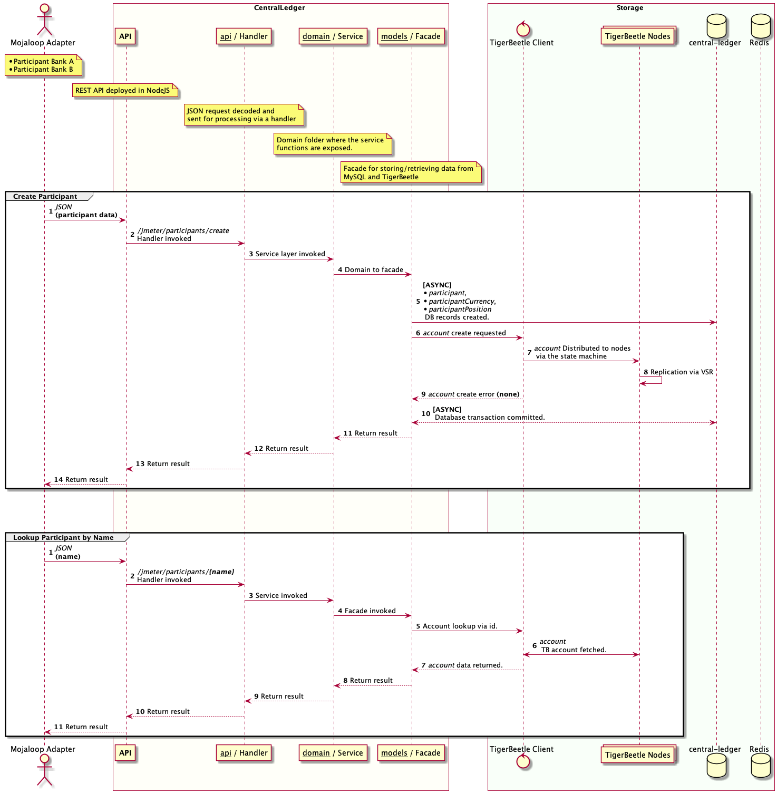
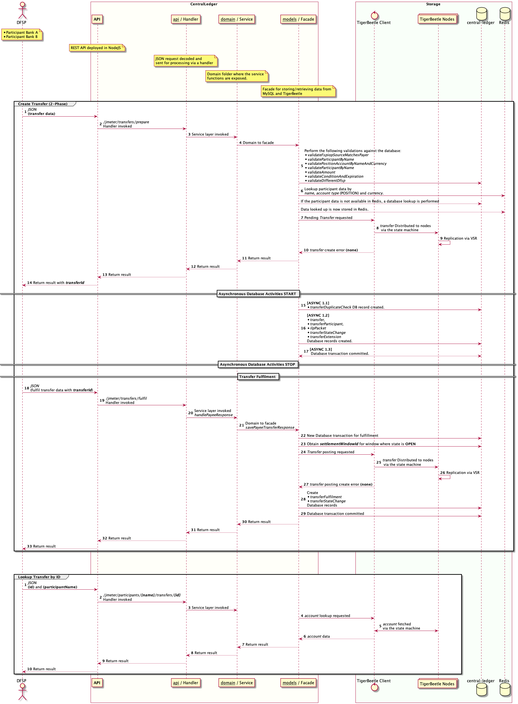
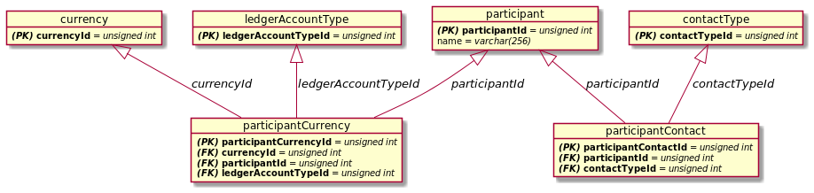

# Mojaloop Tigerbeetle Solution Design

* [Glossary](#glossary)
* [1. Purpose](#1-purpose)
* [2. Background](#2-background)
* [3. Solution Design](#3-solution-design)
  * [3.1. Overview](#31-overview-of-mojaloop-architecture)
  * [3.2. System Context Diagram As Is](#32-system-context-diagram-central-ledger-as-is)
  * [3.3. System Context Diagram with TigerBeetle](#33-system-context-diagram-central-ledger-with-tigerbeetle)
  * [3.4. Functional Requirements](#34-functional-requirements)
  * [3.5. Non-Functional Requirements](#35-non-functional-requirements)
  * [3.6. Assumptions, Dependencies & Considerations](#36-assumptions-dependencies--considerations)
  * [3.7. Scope Exclusions](#37-scope-exclusions)
* [4. Detailed Design](#4-detailed-design)
  * [4.1. Participants](#41-participants)
  * [4.2. Transfers](#42-transfers)
  * [4.3. Settlement](#43-settlement)
* [5. Canonical Model](#5-canonical-model)
  * [5.1. TigerBeetle](#51-tigerbeetle)
  * [5.2. CentralLedger](#52-centralledger)


# Glossary
| Definition  | Description                                                                                                                                                                                                                                                               |
|-------------|---------------------------------------------------------------------------------------------------------------------------------------------------------------------------------------------------------------------------------------------------------------------------|
| Participant | A provider who is a member of a payment scheme, and subject to that scheme's rules.                                                                                                                                                                                       |
| Hub         | The Mojaloop operator.                                                                                                                                                                                                                                                    |
| Transfer    | A debit/credit from one account to another account.                                                                                                                                                                                                                       |
| DFSP        | Digital Financial Service Provider.                                                                                                                                                                                                                                       |
| TigerBeetle | A financial accounting database designed for mission critical safety and performance to power the future of financial services.                                                                                                                                           |
| Endpoint    | An API is a set of protocols and tools to facilitate interaction between two applications. An endpoint is a place on the API where the exchange happens. Endpoints are URIs (Uniform Resource Indices) on an API that an application can access. All APIs have endpoints. |
| JSON        | JSON (JavaScript Object Notation) is a lightweight data-interchange format.                                                                                                                                                                                               |
| REST        | Representational state transfer (REST) is a software architectural style that was created to guide the design and development of the architecture for the World Wide Web.                                                                                                 |


## 1. Purpose
This document describes the solution architecture and system design for using a TigerBeetle database as part of a Mojaloop payments system.

Different sections of this document can be used by an audience that is focussed on:
* the requirements and business drivers of the the solution and
* the technical aspects and components of the design.

## 2. Background
The original design of the Mojaloop payments system used Redis for caching and SQL databases to record the participant, transaction, settlement and operational data. In the original design, the application layer implemented the financial accounting logic, only interacting with the database to store and retrieve the data.
A solution that uses TigerBeetle differs from the original design. The key reason is that TigerBeetle is a purpose-built relational database that natively supports the financial accounting processing. This means deferring to the database to natively handle the financial accounting logic, thus taking away much of the financial accounting processing from the application.

## 3. Solution Design
### 3.1. Overview of Mojaloop Architecture
//TODO @jason We need a diagram with a full view of all


### 3.2. System Context Diagram Central Ledger As Is
//TODO @jason Add the central-settlement as part of the design diagrams...


### 3.3. System Context Diagram Central Ledger with TigerBeetle


### 3.4. Functional Requirements
#### New functionality

* TigerBeetle NodeJS integrated into Central-Ledger
  * Make use of existing configuration `default.json` configuration file for client
  * TigerBeetle NodeJS client to be integrated into central-ledger
  * TigerBeetle enablement through on/off switch
  * TigerBeetle and central-ledger facade (Translate from CL Acc+Transfer to TB Acc+Transfer)
  * 
* jMeter endpoints added for full 
* Timeout function to be reliant on TB instead of timer
* Transfer duplicate check performed as part of TB built in functionality
* jMeter testing suite to test:
  * Transfer
  * 2-phase Transfer
  * Account creation (includes Participant)
  * Account Lookups
  * Transfer Lookups
* 

#### Impact on user experience
#### System behaviour in different scenarios
#### Impact on customer support or operations

### 3.5. Non-functional Requirements
#### Performance
* High increased performance
* Increased deterministic behaviour
* Environment stack testing
* Update docker-compose and Docker files to include freestanding TB environment

#### Availability

#### Security
The following security points need to be noted:

##### Transport
* HTTPS on central-ledger endpoints

##### Storage
* TigerBeetle stores all cold data encrypted under XXXX (TODO @jason complete.)
* Security of sensitive data in the database

##### Other
* Connection security between CL and TB
* Authentication of the CL API

#### Safety (or maybe resiliency, durability)


#### Testing
Test coverage will include:
* Unit testing for Tigerbeetle NodeJS client
* Integration testing for Tigerbeetle NodeJS client
* Integration testing for CL and TB
  * TB on
  * TB off
  * CL off (traditional)
* Performance/Throughput testing via jMeter
* 

@jason TODO

### 3.6. Assumptions, Dependencies & Considerations

#### 3.6.1 Assumptions

#### 3.6.2 Hardware Dependencies
The following hardware dependencies are know.
##### TigerBeetle
##### CentralLedger

#### 3.6.3 Software Dependencies
The following software dependencies are know.
##### TigerBeetle
##### CentralLedger

#### 3.6.4 Considerations

### 3.7. Scope Exclusions

## 4. Detailed Design

### 4.1. Participants


#### 4.1.1 Create Participant
1. Participant JSON Payload.
```json
{
  "id": "123",
  "name": "fspJM61d20f876f3c47828fc9f9a70",
  "currency": "USD",
  "newlyCreated": false
}
```
2. Handler invoked from `/jmeter/participants/create` `POST` endpoint.
3. Service layer

#### 4.1.2 Lookup Participant by Name


### 4.2. Transfers

1. Transfer JSON Payload
```json
{
  "payerFsp": "fspJM962250a50c654d1a9f3d32b9a",
  "amount": {
      "amount": 95,
      "currency": "USD"
  },
  "condition": "GRzLaTP7DJ9t4P-a_BA0WA9wzzlsugf00-Tn6kESAfM",
  "payeeFsp": "fspJM9bd046148c074bdca6323ab12",
  "ilpPacket": "AYIBgQAAAAAAAASwNGxldmVsb25lLmRmc3AxLm1lci45T2RTOF81MDdqUUZERmZlakgyOVc4bXFmNEpLMHlGTFGCAUBQU0svMS4wCk5vbmNlOiB1SXlweUYzY3pYSXBFdzVVc05TYWh3CkVuY3J5cHRpb246IG5vbmUKUGF5bWVudC1JZDogMTMyMzZhM2ItOGZhOC00MTYzLTg0NDctNGMzZWQzZGE5OGE3CgpDb250ZW50LUxlbmd0aDogMTM1CkNvbnRlbnQtVHlwZTogYXBwbGljYXRpb24vanNvbgpTZW5kZXItSWRlbnRpZmllcjogOTI4MDYzOTEKCiJ7XCJmZWVcIjowLFwidHJhbnNmZXJDb2RlXCI6XCJpbnZvaWNlXCIsXCJkZWJpdE5hbWVcIjpcImFsaWNlIGNvb3BlclwiLFwiY3JlZGl0TmFtZVwiOlwibWVyIGNoYW50XCIsXCJkZWJpdElkZW50aWZpZXJcIjpcIjkyODA2MzkxXCJ9IgA",
  "expiration": null,
  "transferId": "f75f50d8-f584-4451-889b-fee8bc350db0",
  "fulfil": false
}
```
2. Handler invoked from `/jmeter/transfers/prepare` `POST` endpoint.
3. Service layer

### 4.3. Settlement


## 5. Canonical Model

### 5.1 TigerBeetle
#### 5.5.1 Account
Mutable data set for account related data.

| Field            | Type              | Description                                                                                                                      |
|------------------|-------------------|----------------------------------------------------------------------------------------------------------------------------------|
| id               | `u128`            | Global unique id for an account.                                                                                                 |
| user_data        | `u128`            | Implementation specific data on account. Opaque third-party identifier to link this account (many-to-one) to an external entity. |
| reserved         | `[48]u8 - array`  | Accounting policy primitives. Not available.                                                                                     |
| unit             | `u16`             | A transfer unit describing the currency associated with the account.                                                             |
| code             | `u16`             | A chart of accounts code describing the type of account (e.g. clearing, settlement)                                              |
| flags            | `AccountFlags`    | See account flags.                                                                                                               |
| debits_reserved  | `u64`             | Balance for reserved debits.                                                                                                     |
| debits_accepted  | `u64`             | Balance for accepted debits.                                                                                                     |
| credits_reserved | `u64`             | Balance for reserved credits.                                                                                                    |
| credits_accepted | `u64`             | Balance for accepted credits.                                                                                                    |
| timestamp        | `u64`             | The current state machine timestamp of the account for state tracking.                                                           |

#### 5.5.2 AccountFlags - `[packed struct]`

| Field                            | Type              | Description                                  |
|----------------------------------|-------------------|----------------------------------------------|
| linked                           | `bool`            | Is the account linked to another account.    |
| debits_must_not_exceed_credits   | `bool`            | Total debit transfer may not exceed credits. |
| credits_must_not_exceed_debits   | `bool`            | Total credit transfer may not exceed debits. |
| padding                          | `u29`             | Data to be used for padding.                 |

#### 5.5.3 Transfer
Transfers for TB are immutable.

| Field             | Type              | Description                                                                                                                       |
|-------------------|-------------------|-----------------------------------------------------------------------------------------------------------------------------------|
| id                | `u128`            | Global unique id for an account.                                                                                                  |
| debit_account_id  | `u128`            | The unit transfer from (Payer) account id.                                                                                        |
| credit_account_id | `u128`            | The unit transfer to (Payee) account id                                                                                           |
| user_data         | `u128`            | Implementation specific data on transfer. Opaque third-party identifier to link this transfer (many-to-one) to an external entity |
| reserved          | `[32]u8 - array`  | Accounting policy primitives. Example; ILP packet.                                                                                |
| timeout           | `u64`             | Used for a 2-phase transfer. The maximum wait timeout in milliseconds for a commit.                                               |
| code              | `u32`             | A chart of accounts code describing the reason for the transfer (e.g. deposit, settlement)                                        |
| flags             | `TransferFlags`   | See transfer flags.                                                                                                               |
| amount            | `u64`             | Transfer amount in units.                                                                                                         |
| timestamp         | `u64`             | The current state machine timestamp of the transfer for state tracking.                                                           |

#### 5.5.4 TransferFlags - `[packed struct]`

| Field                            | Type              | Description                                    |
|----------------------------------|-------------------|------------------------------------------------|
| linked                           | `bool`            | Is the account linked to another account.      |
| two_phase_commit                 | `bool`            | Is the transfer a 2phase commit transfer.      |
| condition                        | `bool`            | Does the transfer support transfer conditions. |
| padding                          | `u29`             | Data to be used for padding.                   |

#### 5.5.5 Commit
> TODO @jason needs to be updated due to Transfer/Commit PR. 

Commits for TB are immutable. A commit can only be performed on a transfer.

| Field             | Type              | Description                                                                              |
|-------------------|-------------------|------------------------------------------------------------------------------------------|
| id                | `u128`            | Global unique id for a transfer.                                                         |
| reserved          | `[32]u8 - array`  | Accounting policy primitives. Not available.                                             |
| code              | `u32`             | A chart of accounts code describing the reason for the commit (e.g. deposit, settlement) |
| flags             | `CommitFlags`     | See commit flags.                                                                        |
| timestamp         | `u64`             | The current state machine timestamp of the commit for state tracking.                    |

#### 5.5.6 CommitFlags - `[packed struct]`
| Field                            | Type              | Description                                                                                                  |
|----------------------------------|-------------------|--------------------------------------------------------------------------------------------------------------|
| linked                           | `bool`            | Is the account linked to another account.                                                                    |
| reject                           | `bool`            | Has the commit been rejected.                                                                                |
| preimage                         | `bool`            | Flag to indicate whether the commit relies on the associated transfer being flagged as a condition transfer. |
| padding                          | `u29`             | Data to be used for padding.                                                                                 |


### 5.2 CentralLedger

#### 5.2.1 Relationships


#### 5.2.2 Participant (`participant`)
| Field         | Type           | Description                    |
|---------------|----------------|--------------------------------|
| participantId | `int unsigned` | Unique participant identifier. |
| name          | `varchar(256)` | Unique participant name.       |
| description   | `varchar(256)` | Unique participant name.       |
| active        | `tinyint`      | Unique participant name.       |
| createdDate   | `datetime`     | Unique participant name.       |
| createdBy     | `datetime`     | Unique participant name.       |

#### 5.2.3 Participant Currency (`participantCurrency`)
| Field         | Type           | Description                    |
|---------------|----------------|--------------------------------|
| participantId | `int unsigned` | Unique participant identifier. |
| name          | `varchar(256)` | Unique participant name.       |
| description   | `varchar(256)` | Unique participant name.       |
| active        | `tinyint`      | Unique participant name.       |
| createdDate   | `datetime`     | Unique participant name.       |
| createdBy     | `datetime`     | Unique participant name.       |

#### 5.2.4 Account

#### 5.2.5 Transfer

#### 5.2.6 Transfer Fulfil


