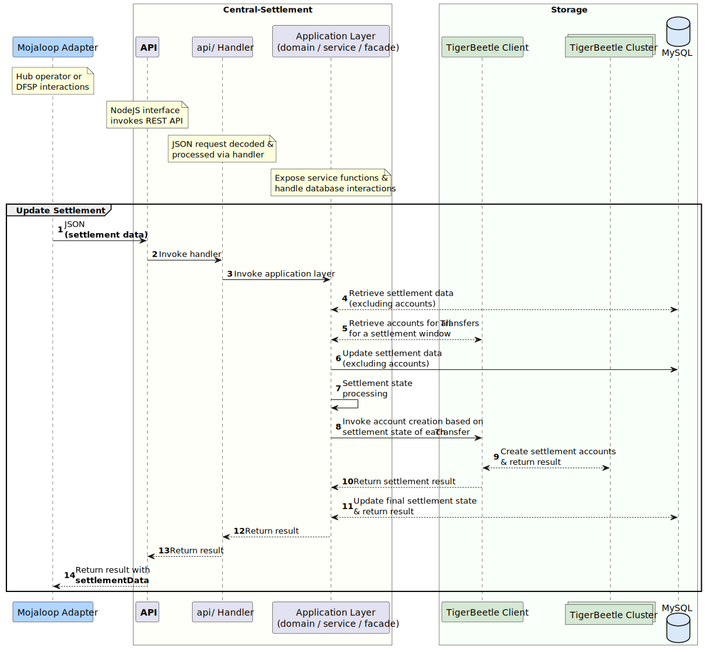
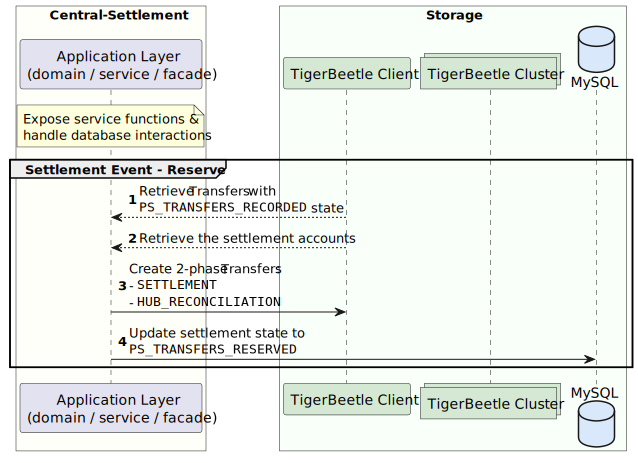
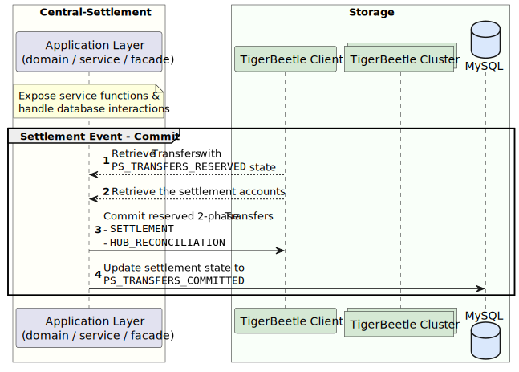

# Solution Design: Mojaloop TigerBeetle Integration

[Glossary](#glossary)
1. [Purpose](#1-purpose)
2. [Introduction](#2-introduction)
3. [Solution Architecture](#3-solution-architecture)  
3.1. [Current Mojaloop Architecture](#31-current-mojaloop-architecture)  
3.2. [As-Is Central Services Architecture](#32-as-is-central-services-architecture)  
3.3. [To-Be Central Services Architecture](#33-to-be-central-services-architecture)
4. [Requirements](#4-requirements)  
4.1. [Functional Requirements](#41-functional-requirements)  
4.2. [Non-Functional Requirements](#42-non-functional-requirements)   
4.3. [Testing Requirements](#43-testing-requirements)
5. [Assumptions, Dependencies & Considerations](#5-dependencies--considerations)
6. [Scope Exclusions](#6-scope-exclusions)
7. [Detailed Design](#7-detailed-design)  
7.1. [TigerBeetle in Central-Ledger](#71-tigerbeetle-in-central-ledger)      
7.2. [TigerBeetle in Central-Settlement](#72-tigerbeetle-in-central-settlement)  
8. [Canonical Model](#8-canonical-model)  
8.1. [TigerBeetle](#81-tigerbeetle)  
8.2. [Central-Ledger](#82-central-ledger)  
8.3. [TigerBeetle and Central-Ledger Mapping](#83-mapping-tigerbeetle-and-central-ledger-tables)
9. [References](#9-references)  

## Glossary
| Definition             | Description                                                                                                                                                                                                                                                                                                                                                                                                                                                     |
|------------------------|-----------------------------------------------------------------------------------------------------------------------------------------------------------------------------------------------------------------------------------------------------------------------------------------------------------------------------------------------------------------------------------------------------------------------------------------------------------------|
| AEAD                   | Authenticated Encryption with Associated Data is an encryption method that aims to provide data integrity, confidentiality and authentication, where ciphertext gets authenticated and its integrity or context gets validated through the use of additional or associated data.                                                                                                                                                                                |
| AEGIS                  | An Advanced Encryption Standard (AES) based authenticated encryption algorithm designed for high-performance applications, using a 256-bit encryption key, and a 256-bit nonce, amongst other things, used to protect associated data.                                                                                                                                                                                                                          |
| Clearing               | The process of transmitting, reconciling, and, in some cases, confirming transactions prior to settlement, potentially including the netting of transactions and the establishment of final positions for settlement. Sometimes this term is also used (imprecisely) to cover settlement. For the clearing of futures and options, this term also refers to the daily balancing of profits and losses and the daily calculation of collateral requirements.     |
| Clearing House         | A central location or central processing mechanism through which financial institutions agree to exchange payment instructions or other financial obligations (for example, securities). The institutions settle for items exchanged at a designated time based on the rules and procedures of the clearinghouse. In some cases, the clearinghouse may assume significant counterparty, financial, or risk management responsibilities for the clearing system. |
| DFSP                   | Digital Financial Service Provider.                                                                                                                                                                                                                                                                                                                                                                                                                             |
| DMZ                    | A demilitarized zone is perimeter network or subnetwork that adds a layer of network security, typically for connections to entities that are external to a network, but also used for internal connections, to enforce restricted network access.                                                                                                                                                                                                              |
| Endpoint               | An API is a set of protocols and tools to facilitate interaction between two applications. An endpoint is a place on the API where the exchange happens. Endpoints are URIs (Uniform Resource Indices) on an API that an application can access. All APIs have endpoints.                                                                                                                                                                                       |
| HTTPS                  | Stands for "HyperText Transport Protocol Secure." HTTPS is the same thing as HTTP, but uses a secure socket layer (SSL) for security purposes.                                                                                                                                                                                                                                                                                                                  |
| Hub                    | In the context of payments, a hub can be described as a platform where one ore more financial services providers integrate multiple payments systems and channels into a payments platform that is managed by one ore more hub operators.                                                                                                                                                                                                                       |
| JSON                   | JSON (JavaScript Object Notation) is a lightweight data-interchange format.                                                                                                                                                                                                                                                                                                                                                                                     |
| Netting                | The offsetting of obligations between or among participants in a settlement arrangement, thereby reducing the number and value of payments or deliveries needed to settle a set of transactions.                                                                                                                                                                                                                                                                |
| Participant            | A provider who is a member of a payment scheme, and subject to that scheme's rules.                                                                                                                                                                                                                                                                                                                                                                             |
| PISP                   | A payments initiation service provider is an authorized third-party that enables payments initiation directly from the wallet or account of an account holder.                                                                                                                                                                                                                                                                                                  |
| REST                   | Representational state transfer (REST) is a software architectural style that was created to guide the design and development of the architecture for the World Wide Web.                                                                                                                                                                                                                                                                                       |
| Settlement             | An act that discharges obligations in respect of funds or securities transfers between two or more parties.                                                                                                                                                                                                                                                                                                                                                     |
| Settlement Instruction | Means an instruction given to a settlement system by a settlement system participant or by a payment clearing house system operator to effect settlement of one or more payment obligations, or to discharge any other obligation of one system participant to another participant.                                                                                                                                                                             |
| Settlement Obligation  | Means an indebtedness that is owed by one settlement system participant to another as a result of one or more settlement instructions.                                                                                                                                                                                                                                                                                                                          |
| Settlement System      | A system used to facilitate the settlement of transfers of funds, assets or financial instruments. Net settlement system: a funds or securities transfer system which settles net settlement positions during one or more discrete periods, usually at pre-specified times in the course of the business day. Gross settlement system: a transfer system in which transfer orders are settled one by one.                                                       |
| TigerBeetle            | A financial accounting database designed for mission critical safety and performance to power the future of financial services.                                                                                                                                                                                                                                                                                                                                 |
| TLS/SSL                | Transport Layer Security (TLS) certificates—most commonly known as SSL, or digital certificates—are the foundation of a safe and secure internet. TLS/SSL certificates secure internet connections by encrypting data sent between systems.                                                                                                                                                                                                                     |
| Transfer               | A debit/credit from one account to another account.                                                                                                                                                                                                                                                                                                                                                                                                             |
| VPN Tunnel             | A VPN (virtual private network) tunnel is link between a computer or mobile device and an outside network, that is secured by encryption.                                                                                                                                                                                                                                                                                                                       |
| WAF                    | A WAF or web application firewall helps protect web applications by filtering and monitoring HTTP traffic between a web application and the Internet (_or internal network_).                                                                                                                                                                                                                                                                                   |
---

## 1. Purpose
This document details the solution architecture and design for using a TigerBeetle database as the back-end for the Central Ledger and Central Settlement services of a Mojaloop payments system.

Different sections of this document can be used by an audience that is focused on:
* the business drivers for the solution;
* the architecture and solution design aspects for integrating TigerBeetle into Mojaloop; and
* the components and endpoints for the solution.

## 2. Introduction
The original design of the Mojaloop payments system uses Redis for caching and SQL databases to record participant, transaction, settlement and operational data. 
In the original design, the application layer implements the business and financial accounting logic, which then interacts with the database to persist and retrieve the data. 

TigerBeetle is a distributed database built for native financial accounting support. It leverages the original Mojaloop Central-Ledger logic in order to implement the financial accounting logic natively, within the database. In this proposed solution, the Mojaloop application layer optimizes its database interactions and defers the financial accounting logic to TigerBeetle.

This solution architecture has been prompted by business drivers that aim to enhance aspects of the cost of operations and processing capabilities of a Mojaloop solution deployment. The goal is to support or enhance:
- Efficient and secure immediate funds transfer with same day settlement.
- Transaction data redundancy and high availability.
- Transaction data integrity and security.
- Significant growth in transaction volumes with minimal negative impact on the transaction processing performance.

## 3. Solution Architecture
### 3.1. Current Mojaloop Architecture
The diagram below shows the current architecture of a Mojaloop payments hub, and it illustrates interactions between the hub and external entities such as a settlement bank, a global account lookup service and the systems of other financial service providers.

The Mojaloop Hub is the primary container and reference that is used to describe the Mojaloop ecosystem, which is split into the following domains:
- Mojaloop Open Source Services: the API and the core Mojaloop Open Source Software (OSS). 
- Mojaloop Hub: a customizable implementation of the Mojaloop OSS, which operated by a hub operator.

  

### 3.2. As-Is Central Services Architecture
In the **current** architecture of Central Services, the Central-Ledger and Central Settlement use SQL, PostgreSQL or MySQL and Redis to store and cache data.  

### 3.3. To-Be Central Services Architecture
This diagram illustrates the Central Services architecture where Central-Ledger and Central Settlement use TigerBeetle to store the financial accounting data for Transfers and Settlement (i.e. the accounts and balances), while the SQL and Redis databases store all other transaction, participant, and operational data.  

## 4. Requirements
### 4.1. Functional Requirements
#### 4.1.1. Transaction Scenarios
The table below maps current transaction scenarios and hub processes to one or more of the following TigerBeetle functional areas: accounts, transfers, and queries.

| Transaction Scenarios & Hub Processes                              | Accounts | Transfers | Queries |
|--------------------------------------------------------------------|----------|-----------|---------|
| Funds transfers (and duplicate checks)                             | X        | X         |         |
| Purchase goods (and duplicate checks)                              | X        | X         |         |
| Bulk purchases (and duplicate checks)                              | X        | X         |         |
| Manage transfer timeouts                                           |          | X         |         |
| Enquiries (accounts & balances)                                    |          |           | X       |
| Account management (participants & customers)                      | X        |           |         |
| Fraud Checks and blacklists (enforce account statuses)             | X        |           | X       |
| Tiered risk management (enforce account statuses & balance limits) | X        |           | X       |
| Trigger settlement event against settlement model                  | X        |           |         |
| Record transfers for a Settlement                                  |          | X         | X       |
| Reserve Settlement                                                 |          | X         | X       |
| Commit Settlement                                                  |          | X         | X       |

### 4.2. Non-functional Requirements
#### 4.2.1. Performance
Performance gains in TigerBeetle are enabled by:
* Using **small, simple fixed-size data structures** (accounts and transfers) in a tightly scoped domain.
* Simplifying the application layer to remain stateless by implementing all  **account and balance logic** in the database. 
* **Eliminating the need to cache** account and balance data, and the need to repeatedly move the data between the database and the application. 
* Lowering disk and network latency for high and low transaction volumes through **amortizing the cost of network calls and disk I/O** by:
  * handling all transaction processing in **batches** of a configurable fixed or dynamic window (from 1ms);
  * using large sequential disk write and a single network request for a batch of transactions; and
  * ensuring that memory usage gets optimized for small batches by using **zero-copy direct I/O** from the network to disk.
* Optimizing kernel interactions by using **io_uring**  which uses asynchronous system calls for networking and storage I/O. This concurrency significantly reduces the cost of transaction processing.
* Using **flexible quorums** to reduce the total cost of cluster replication to synchronous replication for, at most, 2 replicas with asynchronous replication to the remaining replicas.  
* Using "tail tolerance" as a performance and **fault tolerance** technique to route around **transient gray failure**. 
  * **Example** - if a disk write that typically takes 4ms starts taking 4 seconds because the disk is slowly failing, TigerBeetle cluster redundancy route around the failing disk, so that users do not experience the 4 second latency spike.

#### 4.2.2. Safety, Integrity and Availability
Fault tolerance, high availability, and self-healing are at the core of TigerBeetle. These are enabled by: 
* Using hash-chained cryptographic checksums to **detect and repair** disk corruption and misdirected disk writes.
* **TODO - need to reword so that it's clear what the value & impact is ->** Using **direct disk I/O** to side step cache coherency bugs in the kernel page cache after an EIO fsync error. This reduces a lot of internal system transfer and process time.
* The distributed architecture that exceeds single-disk write durability, and mitigates the risk of single-server failure.  
* Providing strict serializability through a replicated state machine for consistent transaction ordering across replicas.
* Low-latency automated leader election to mitigate the risk of data integrity issues across replicas.
* Low-latency synchronous replication to a quorum (i.e. > 50%) of replicas for recovery from storage corruption or failure.
* Leader-based timestamping eliminates dependencies on synchronized system clocks. The leader clock is kept within safe bounds by combining all the clocks in a cluster to create a fault-tolerant clock called ["cluster time"](https://www.tigerbeetle.com/post/three-clocks-are-better-than-one).

##### 4.2.3. Secure Transport
To secure data transmission between TigerBeetle and Mojaloop Central Services, enabling transport layer security is recommended:
* Configuring HTTPS for the TigerBeetle to Central-Ledger and Central-Settlement endpoints, in NodeJS or WAF/Load-Balancer.
* Establishing a VPN connection between TigerBeetle and Central-Ledger as well as Central-Settlement.
* Product roadmap: mTLS is on the TigerBeetle product roadmap, to enforce mutual authentication between a TigerBeetle client and the cluster, using a certificate authority (CA), and Public/Private keys.

##### 4.2.4. Secure Storage
* Product roadmap: AEAD encryption for data at-rest, using AEGIS-256, is on the TigerBeetle roadmap, however the release outlook is not yet set.

### 4.3. Testing Requirements
Testing coverage includes:
* Unit and integration testing for TigerBeetle NodeJS client;
* Integration testing with TigerBeetle enabled and disabled; and
* Performance testing.

#### 4.3.1. Test Suite & Tools
The test suite comprises jUnit test cases, and a jMeter test package that includes endpoints and test data:
- **Jest** - a delightful JavaScript Testing Framework with a focus on simplicity.
- **jUnit** - testing framework for the Java programming language.
- **jMeter** - endpoints for creating or retrieving Participants and Transfers. jMeter test configuration makes it possible to generate the desired test data for functional or performance test execution.  

#### 4.3.2. Test cases
The following test transaction scenarios are central to the test suite:
- Account lookups
- Transfer lookups
- Immediate commit transfers
- 2-Phase commit transfers
- Account & participant creation
- Deactivate accounts & participants
- **TODO** - add test cases for settlement
- **TODO** - add negative test cases

#### 4.3.3. Performance Testing
- **TODO** - add info about the performance tests

## 5. Dependencies & Considerations
### 5.1 Hardware Dependencies
This section provides the minimum hardware requirements for a TigerBeetle deployment for Mojaloop Central-Ledger and Central-Settlement.
- 6x TigerBeetle replicas, with the following resources provisioned for **each replica**:
  - 2GiB RAM
  - single core CPU (note: not yet built to use dual or multiple cores)
  - **TODO - update ->** storage with between 10GiB (for an approximate lower limit of **yy** transfers) and 20 TiB (for approximately 50 billion transfers)
    - **optional**: use of RAID 10 to limit the need for remote recovery if the disk of a replica's fails

### 5.2 Software Dependencies
A TigerBeetle release is a single binary that supports the following operating systems:
* Linux (`x64`)
* MacOS (`x64/arm`)
* Windows (`x64`)

## 6. Scope Exclusions
The following functionality is out of scope for the solution:
* Transfer and settlement data encryption at rest (refer to section ABC for detail).
* Built-in support for mTLS authentication between a TigerBeetle client and the database cluster.

## 7. Detailed Design 
### 7.1 TigerBeetle in Central-Ledger 
Integrating TigerBeetle into the Mojaloop Central-Ledger requires **2 major elements**:
* A NodeJS client for TigerBeetle.
* A TigerBeetle NodeJS Interface that:
    * uses a configurable user parameter to enable or disable TigerBeetle;
    * requires updating an existing `default.json` configuration file for the TigerBeetle client; and
    * implements protocol translation and orchestrating interactions between Central-Ledger and TigerBeetle accounts and transfers.

#### 7.1.1 Participants
This section covers the sequence diagram and transaction flow details for the creation and retrieval 
of a Mojaloop Hub DFSP Participant.

##### 7.1.1.1 Create Participant

1. A JSON HTTP `POST` payload is initiated to create a Participant.
2. Handler invoked from endpoint.
3. Invoke the layer that exposes the service functions & handles database interactions
4. Create the SQL database records to store the Participant data (excluding the account data), and return the database result.
5. Invoke the TigerBeetle client to create the Participant account in the TigerBeetle database.
6. Create the Participant account on the TigerBeetle cluster, and return the result.
7. Return the Participant account creation result. In this scenario, there were no errors.
8. Result returned.
9. Result returned.
10. Result is returned to the DFSP via the REST API.

##### 7.1.1.2 Lookup Participant by Name

1. DFSP/Mojaloop Adapter invokes HTTP request
2. Handler invoked from endpoint.
3. Invoke the layer that exposes the service functions & handles database interactions
4. Retrieve the Participant data from cache using the participant `name`.
   1. If the data is not available in the cache, then retrieve from the SQL database, followed by caching the participant data.
5. Invoke the TigerBeetle client to retrieve the participant `account` using the Participant ID.
6. TigerBeetle client retrieves the Participant account from the cluster.
7. Account data is returned by the TigerBeetle client.
8. Result returned.
9. Result returned.
10. Result is returned to the DFSP via the REST API, with account and balance data.

#### 7.1.2 Transfers
Sequence related to a transfer with relation to Central-Ledger and TigerBeetle.

##### 7.1.2.1 Create Transfer (2-Phase)
The _prepare_ phase of the 2-Phase Transfer:

1. DFSP initiates a transfer, this submits a _Transfer_ prepare request (this is a JSON payload).
2. Handler invoked from endpoint.
3. Invoke the layer that exposes the service functions & handles database interactions
#### TODO: note to discuss/confirm the validation descriptions with Jason
4. Perform SQL database validations for the _Transfer_:  
   1. `validateFspiopSourceMatchesPayer` -> Validate the headers of the payer and payee DFSPs
   2. `validateParticipantByName` -> Validate the payer and payee participants by doing a lookup by name
   3. `validatePositionAccountByNameAndCurrency` -> Validate that the payer and payee accounts exist, using the DFSP participant name and the account currency
   4. `validateParticipantByName` -> Validate that the payer and payee participants exists, using the participant name for the lookup
   5. `validateAmount` -> Validates the allowed scale of decimal places and precision for the transfer amount
   6. `validateConditionAndExpiration` -> Validate all conditions and the expiration of the payer and payee participants
   7. `validateDifferentDfsp` -> Validate that the payer and payee DFSPs are different
5. Retrieve the Participant data from cache.
    1. If the data is not available in the cache, then retrieve from the SQL database, followed by caching the participant data.
6. Invoke the TigerBeetle client to create an **account** for the prepare _Transfer_. TigerBeetle sets the pending flag to `true`.
7. The TigerBeetle database performs duplicate checks for the incoming prepare _Transfer_, and then commits to the database.
8. The TigerBeetle client returns the result after commiting the prepare _Transfer_.
9. Insert the prepare _Transfer_ data into the SQL database, excluding the _Transfer_ account data stored in TigerBeetle.
10. Return the SQL database result for storing the prepare _Transfer_ data.
11. Result returned.
12. Result is returned to the DFSP, via the REST API.

This diagram illustrates the _commit_ or _fulfil_ phase of the 2-Phase Transfer:

1. DFSP submits a _Transfer_ fulfil request (this is a JSON payload). 
2. Handler invoked from endpoint.
3. Invoke the layer that exposes the service functions & handles database interactions.
4. Initiate a new SQL database transaction for the fulfil _Transfer_. The current open `settlementWindowId` is obtained for the current **OPEN** settlement window.
5. To post the _Transfer_, the TigerBeetle client is invoked with a _Transfer_ `post_pending_transfer = true` property.
6. The _Transfer_ fulfillment gets distributed to the TigerBeetle cluster.
7. The TigerBeetle client returns the result after committing the fulfil _Transfer_ to the database.
8. Return result to the handler layer.
9. Result returned.
10. Result is returned to the DFSP, via the REST API.

##### 7.1.2.2 Lookup Transfer by ID

1. DFSP submits a _Transfer_ lookup request (this is a JSON payload).
2. Handler invoked from endpoint.
3. Invoke the layer that exposes the service functions & handles database interactions.
4. The TigerBeetle client is invoked in order to obtain the `account` information.
5. TigerBeetle client fetches the necessary account information from one of the TigerBeetle nodes.
6. Transfer data is returned from the TigerBeetle client.
7. **OPTIONAL** Additional transfer data is obtained from the SQL database, using the `transactionId`.
8. Return the Transfer data or the result.
9. Return the Transfer data or the result.
10. Return the Transfer data or the result to the DFSP, via the REST API.

### 7.2 TigerBeetle in Central-Settlement
#### 7.2.1 Initiate Settlement
Settlement gets initiated by an event called `settlementEventTrigger` which indicates all of the settlement windows that must be included in the process.  
Each settlement event is associated with one `settlementId`, and the `updateSettlementById` endpoint manages the entire settlement process.  

1. The hub operator or a scheduled event triggers the settlement initiation.  
This sets the settlement granularity, delay, liquidity check configuration, account types, and the settlement currency.
2. Handler invoked from endpoint.
3. Invoke the layer that exposes the service functions & handles database interactions.
4. Insert settlement data into the SQL database:
   1. `settlement` a single entry for the settlement record.
   2. `settlementSettlementWindow` for each settlement window.
   3. `settlementStateChange` for each settlement window.
5. Retrieve fulfilled transfers for the settlement window.
6. Request settlement account creation in TigerBeetle.
7. Create the settlement accounts for each Participant:  
   1. Account for participant: `Participant settlement account` per settlement for each payer/payee.
   2. Account for Hub reconciliation, account per currency for recon: `Hub reconciliation account` per currency type.
   3. Account for Hub multilateral settlement:  `Multilateral settlement account` per currency for each payer/payee.
8. The TigerBeetle client returns the settlement account creation result.
9. Return result to the handler layer.
10. Result returned.
11. Return the settlement initiation result to the DFSP, via the REST API.

#### 7.2.2 Update Settlement
As part of the settlement process, the `updateSettlementById` endpoint uses the `settlementId` of the current settlement event to iteratively associate Transfers to settlement accounts, for each of the settlement windows.

1. A hub operator or DFSP participant initiates updating the settlement state.
2. The REST API uses the `settlementId` to invoke the handler.
3. The handler invokes the layer that exposes the service functions and handles database interactions.
4. The Application layer retrieves settlement data from the SQL database, using the `settlementId` (**note**: this excludes settlement account data).
5. The Application layer uses the settlement window to retrieve all posted or committed _Transfer_ accounts from TigerBeetle, where settlement is pending.
6. Validate the _Transfer_ state data, and update the settlement data in SQL. (**TODO**: I need help with improving this description please)
7. ** Process the settlement states for each _Transfer_ via the `updateSettlementById` endpoint.
8. Based on the settlement state of each _Transfer_, invoke the creation of settlement accounts, via the TigerBeetle Client.
9. TigerBeetle creates the linked _Transfer_ accounts for settlement processing (for each of the settlement models and currencies), and returns the settlement processing result. (**TODO**: need help to check whether this description is correct & complete)
10. Return the TigerBeetle settlement result. 
11. The Application layer updates the final settlement state in the SQL database, and returns the result.
12. The Application layer returns the settlement result to the handler.
13. The handler layer returns the result to the REST API.
14. The REST API returns the settlement result to the DFSP.

** The table below shows the settlement state progression events for each _Transfer_:

| Starting Settlement State | Settlement Status Check / Event                                     | Post-processing State    |
|---------------------------|---------------------------------------------------------------------|--------------------------|
| `PENDING_SETTLEMENT`      | settlementTransfersPrepare                                          | `PS_TRANSFERS_RECORDED`  |
| `PS_TRANSFERS_RECORDED`   | settlementTransfersReserve                                          | `PS_TRANSFERS_RESERVED`  |
| `PS_TRANSFERS_RESERVED`   | settlementTransfersCommit                                           | `PS_TRANSFERS_COMMITTED` |
| `PS_TRANSFERS_COMMITTED`  | validate ALL transfers committed and ALL settlement windows closed  | `SETTLED`                |

##### 7.2.2.1 Settlement Event - Prepare
This initiates the settlement process and sets the settlement state to `PENDING_SETTLEMENT` for all _Transfers_ that are cleared.  
At the successful completion of the event, the settlement state will be set `PS_TRANSFERS_RECORDED`. 

1. Use the current `settlementId` to invoke the TigerBeetle Client to retrieve the _Transfers_ where the settlement state is `PENDING_SETTLEMENT`. This is invoked for every settlement window in the current settlement event.
2. Use the current `settlementId` to invoke the TigerBeetle Client to retrieve the accounts that were created when the settlement event was triggered, where the account type is `SETTLEMENT`. The goal is to link the settlement accounts to the _Transfers_ retrieved in step 1.
3. Create 1-phase transfers for settlement, based on the `settlementWindow` of each Transfer.
4. For each _Transfer_, update the settlement state to `PS_TRANSFERS_RECORDED`, and continue with the settlement process.

##### 7.2.2.2 Settlement Event - Reserve
This event initiates the settlement reservation that progresses the settlement state of _Transfers_ from `PS_TRANSFERS_RECORDED` to `PS_TRANSFERS_RESERVED`. 

1. Use the current `settlementId` to invoke the TigerBeetle Client to retrieve the _Transfers_ where the settlement state is `PS_TRANSFERS_RECORDED`. This is invoked for every settlement window in the current settlement event. 
2. Use the current `settlementId` to invoke the TigerBeetle Client to retrieve the accounts that were created when the settlement event was triggered, where the account type is `SETTLEMENT`. The goal is to link the settlement accounts to the _Transfers_ retrieved in step 1.
3. Create 2-phase transfers for settlement, based on the `settlementWindow` of each Transfer.
4. For each _Transfer_, update the settlement state to `PS_TRANSFERS_RESERVED`, and continue with the settlement process.

##### 7.2.2.3 Settlement Event - Commit
This event initiates the final step where settlement gets committed for all _Transfers_ with a settlement state of `PS_TRANSFERS_RESERVED` getting progressed to `PS_TRANSFERS_COMMITTED`.

1. Use the current `settlementId` to invoke the TigerBeetle Client to retrieve the _Transfers_ where the settlement state is `PS_TRANSFERS_RESERVED`. This is invoked for every settlement window in the current settlement event.
2. Use the current `settlementId` to invoke the TigerBeetle Client to retrieve the accounts that were created when the settlement event was triggered, where the account type is `SETTLEMENT`. The goal is to link the settlement accounts to the _Transfers_ retrieved in step 1.
3. Commit the reserved 2-phase transfers based on each of the pending transfers for the `settlementWindow`.
4. For each _Transfer_, update the settlement state to `PS_TRANSFERS_COMMITTED`, and continue with the settlement process.

##### 7.2.2.4 Settlement Completion

The settlement state for all _Transfers_ gets updated from `PS_TRANSFERS_COMMITTED` to `SETTLED` once all Transfers have a settlement state of `PS_TRANSFERS_COMMITTED`, and all settlement windows are closed.

## 8. Canonical Model
The following Central-Ledger and TigerBeetle Canonical Data Model presents data entities and relationships in their simplest form.

### 8.1 TigerBeetle
TigerBeetle supports only `Account` and `Transfer` data types.

#### 8.1.1 Account
Mutable data set for account related data.

| Field           | Type             | Description                                                                                                                      |
|-----------------|------------------|----------------------------------------------------------------------------------------------------------------------------------|
| id              | `u128`           | Global unique id for an account.                                                                                                 |
| user_data       | `u128`           | Implementation specific data on account. Opaque third-party identifier to link this account (many-to-one) to an external entity. |
| reserved        | `[48]u8 - array` | Accounting policy primitives. Not available.                                                                                     |
| ledger          | `u16`            | The ledger the account belongs to (position, settlement, fees etc).                                                              |
| code            | `u16`            | The currency code/type for the account                                                                                           |
| flags           | `AccountFlags`   | See account flags.                                                                                                               |
| debits_pending  | `u64`            | Balance for reserved debits.                                                                                                     |
| debits_posted   | `u64`            | Balance for accepted debits.                                                                                                     |
| credits_pending | `u64`            | Balance for reserved credits.                                                                                                    |
| credits_posted  | `u64`            | Balance for accepted credits.                                                                                                    |
| timestamp       | `u64`            | The current state machine timestamp of the account for state tracking.                                                           |

##### 8.1.1.1 AccountFlags
Used to track additional properties of an Account.

| Field                            | Type              | Description                                  |
|----------------------------------|-------------------|----------------------------------------------|
| linked                           | `bool`            | Is the account linked to another account.    |
| debits_must_not_exceed_credits   | `bool`            | Total debit transfer may not exceed credits. |
| credits_must_not_exceed_debits   | `bool`            | Total credit transfer may not exceed debits. |
| padding                          | `u29`             | Data to be used for padding.                 |

#### 8.1.2 Transfer
Transfers for TigerBeetle are immutable.

| Field             | Type              | Description                                                                                                                       |
|-------------------|-------------------|-----------------------------------------------------------------------------------------------------------------------------------|
| id                | `u128`            | Global unique id for an account.                                                                                                  |
| debit_account_id  | `u128`            | The unit transfer from (Payer) account id.                                                                                        |
| credit_account_id | `u128`            | The unit transfer to (Payee) account id                                                                                           |
| user_data         | `u128`            | Implementation specific data on transfer. Opaque third-party identifier to link this transfer (many-to-one) to an external entity |
| reserved          | `[32]u8 - array`  | Accounting policy primitives. Example; ILP packet.                                                                                |
| timeout           | `u64`             | Used for a 2-phase transfer. The maximum wait timeout in milliseconds for a commit.                                               |
| code              | `u32`             | A chart of accounts code describing the reason for the transfer (e.g. deposit, settlement)                                        |
| flags             | `TransferFlags`   | See transfer flags.                                                                                                               |
| amount            | `u64`             | Transfer amount in units.                                                                                                         |
| timestamp         | `u64`             | The current state machine timestamp of the transfer for state tracking.                                                           |

##### 8.1.2.1 TransferFlags
Used to track additional properties of a Transfer.

| Field       | Type              | Description                                    |
|-------------|-------------------|------------------------------------------------|
| linked      | `bool`            | Is the account linked to another account.      |
| pending     | `bool`            | Is the transfer a 2-phase commit transfer.     |
| condition   | `bool`            | Does the transfer support transfer conditions. |
| padding     | `u29`             | Data to be used for padding.                   |

### 8.2 Central-Ledger
The diagram below shows the Central-Ledger database tables and their relationships.

**TODO**: LEFT OFF HERE - NEED TO UPDATE DIAGRAM

### 8.3 Mapping TigerBeetle and Central-Ledger Tables
The tables below show the data mappings between Central-Ledger and TigerBeetle.

#### 8.3.1 Account
The mapping between TigerBeetle accounts and Central-Ledger participant and surrounding mappings (participant, participantCurrency, participantPosition etc.).

| TigerBeetle Field   | Central-Ledger Mapping                    | Description                                                                                                             |
|---------------------|-------------------------------------------|-------------------------------------------------------------------------------------------------------------------------|
| `id`                | Not applicable.                           | Global unique id for an account.                                                                                        |
| `user_data`         | `participant.participantId`               | Each participant will have multiple accounts per `participantId` depending on `ledger` and `code`. One to many mapping. |
| `reserved`          | Not applicable.                           | Reserved for future use.                                                                                                |
| `ledger`            | `currency.currencyId`                     | Each Central-Ledger 'currency id' maps to a TigerBeetle ledger currency (USD, ZAR, EUR etc).                            |
| `code`              | `ledgerAccountType.ledgerAccountTypeId`   | Each Central-Ledger ' account type' maps to a TigerBeetle code.                                                         |
| `flags`             | `participantLimit`                        | Flags are TigerBeetle specific. Typical flags would be credit/debit to not exceed credit/debit.                         |
| `debits_pending`    | `participantPosition`                     | Debit balance for an account awaiting rollback or fulfilment.                                                           |
| `debits_posted`     | `participantPosition`                     | Debit balance for fulfilled transfers.                                                                                  |
| `credits_pending`   | `participantPosition`                     | Credit balance for an account awaiting rollback or fulfilment.                                                          |
| `credits_posted`    | `participantPosition`                     | Credit balance for fulfilled transfers.                                                                                 |
| `timestamp`         | Not applicable.                           | TigerBeetle specific functionality.                                                                                     |

#### 8.3.2 Transfer
The mapping between TigerBeetle transfers and Central-Ledger transfer and surrounding mappings (transfer, transferParticipant, expiringTransfer etc.).

TigerBeetle financial domain makes use of double-entry -accounts.

| TigerBeetle Field   | Central-Ledger Mapping                       | Description                                                                                  |
|---------------------|----------------------------------------------|----------------------------------------------------------------------------------------------|
| `id`                | Not applicable.                              | Global unique id for a transfer.                                                             |
| `debit_account_id`  | `transferParticipant.transferParticipantId`  | The TigerBeetle `account.id` referenced as the foreign key for Payer.                        |
| `credit_account_id` | `transferParticipant. transferParticipantId` | The TigerBeetle `account.id` referenced as the foreign key for Payee.                        |
| `user_data`         | `transfer.transferId`                        | The Central-Ledger `transferId` referenced to link transfers in TigerBeetle.                 |
| `reserved`          | Not applicable.                              | Reserved for future use.                                                                     |
| `pending_id`        | Not applicable.                              | The TigerBeetle id for the Transfer created as a prepare transfer.                           |
| `ledger`            | `currency.currencyId`                        | Each Central-Ledger 'currency id' maps to a TigerBeetle ledger currency (USD, ZAR, EUR etc). |
| `timeout`           | `expiringTransfer.expirationDate`            | The TigerBeetle transfer timeout matches the Central-Ledger `expirationDate`.                |
| `code`              | `ledgerAccountType.ledgerAccountTypeId`      | The TigerBeetle account type code, such as 1=position, 2=settlement, 3=fees etc.             |
| `flags`             | Not applicable.                              | TigerBeetle internal flags for linking transfers, posting and reversing 2-phase transfers.   |
| `amount`            | `transfer.amount`                            | Values are expressed in the minor denomination (e.g. cents) for TigerBeetle.                 |
| `timestamp`         | Not applicable.                              | The current state machine timestamp of the transfer for state tracking.                      |

## 9. References
| Title                               | Link                                                                        |
|-------------------------------------|-----------------------------------------------------------------------------|
| TigetBeetle                         | https://www.tigerbeetle.com/                                                |
| TigetBeetle on GitHub               | https://github.com/coilhq/tigerbeetle                                       |
| TigerBeetle Accounts and Transfers  | https://github.com/coilhq/tigerbeetle/wiki/Accounts-and-Transfers           |
| Central-Ledger on GitHub            | https://github.com/mojaloop/central-ledger                                  |
| Mojaloop Technical Overview         | https://docs.mojaloop.io/legacy/mojaloop-technical-overview/                |
| Central-Ledger Process Design       | https://docs.mojaloop.io/legacy/mojaloop-technical-overview/central-ledger/ |
| Central-Ledger API Specification    | https://docs.mojaloop.io/legacy/api/#central-ledger-api                     |
