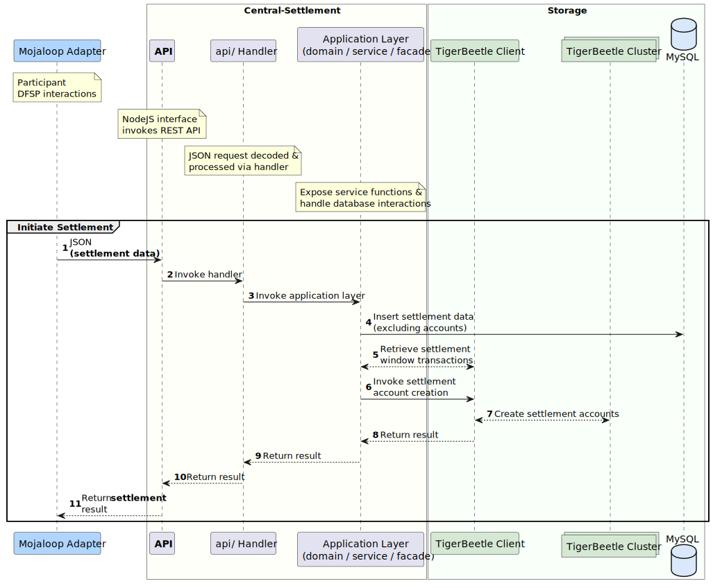
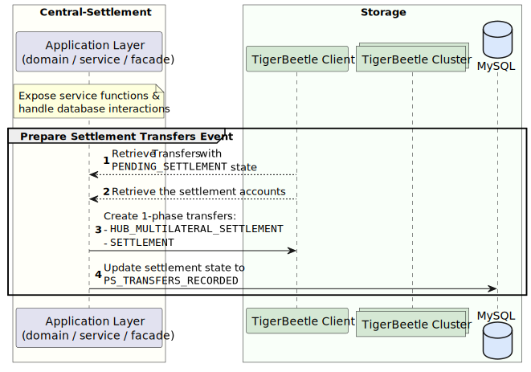

# Solution Design: Mojaloop TigerBeetle Integration

[Glossary](#glossary)
1. [Purpose](#1-purpose)
2. [Introduction](#2-introduction)
3. [Solution Architecture](#3-solution-architecture)  
3.1. [Current Mojaloop Architecture](#31-current-mojaloop-architecture)  
3.2. [Central-Ledger Architecture](#32-mojaloop-central-ledger-architecture)
4. [Requirements](#4-requirements)  
4.1. [Functional Requirements](#41-functional-requirements)  
4.2. [Non-Functional Requirements](#42-non-functional-requirements)   
4.3. [Testing Requirements](#43-testing-requirements)
5. [Assumptions, Dependencies & Considerations](#5-dependencies--considerations)
6. [Scope Exclusions](#6-scope-exclusions)
7. [Detailed Design](#7-detailed-design)  
7.1. [TigerBeetle in Central-Ledger](#71-tigerbeetle-in-central-ledger)      
7.2. [TigerBeetle in Central-Settlement](#72-tigerbeetle-in-central-settlement)  
8. [Canonical Model](#8-canonical-model)  
8.1. [TigerBeetle](#81-tigerbeetle)  
8.2. [Central-Ledger](#82-central-ledger)  
8.3. [TigerBeetle and Central-Ledger Mapping](#83-tigerbeetle-and-central-ledger-mapping)
9. [References](#9-references)  

## Glossary
| Definition             | Description                                                                                                                                                                                                                                                                                                                                                                                                                                                     |
|------------------------|-----------------------------------------------------------------------------------------------------------------------------------------------------------------------------------------------------------------------------------------------------------------------------------------------------------------------------------------------------------------------------------------------------------------------------------------------------------------|
| AEAD                   | .                                                                                                                                                                                                                                                                                                                                                                                                                                                               |
| AEGIS                  | .                                                                                                                                                                                                                                                                                                                                                                                                                                                               |
| Clearing               | The process of transmitting, reconciling, and, in some cases, confirming transactions prior to settlement, potentially including the netting of transactions and the establishment of final positions for settlement. Sometimes this term is also used (imprecisely) to cover settlement. For the clearing of futures and options, this term also refers to the daily balancing of profits and losses and the daily calculation of collateral requirements.     |
| Clearing House         | A central location or central processing mechanism through which financial institutions agree to exchange payment instructions or other financial obligations (for example, securities). The institutions settle for items exchanged at a designated time based on the rules and procedures of the clearinghouse. In some cases, the clearinghouse may assume significant counterparty, financial, or risk management responsibilities for the clearing system. |
| DFSP                   | Digital Financial Service Provider.                                                                                                                                                                                                                                                                                                                                                                                                                             |
| DMZ                    | A demilitarized zone is perimeter network or subnetwork that adds a layer of network security, typically for connections to entities that are external to a network, but also used for internal connections, to enforce restricted network access.                                                                                                                                                                                                              |
| Endpoint               | An API is a set of protocols and tools to facilitate interaction between two applications. An endpoint is a place on the API where the exchange happens. Endpoints are URIs (Uniform Resource Indices) on an API that an application can access. All APIs have endpoints.                                                                                                                                                                                       |
| HTTPS                  | Stands for "HyperText Transport Protocol Secure." HTTPS is the same thing as HTTP, but uses a secure socket layer (SSL) for security purposes.                                                                                                                                                                                                                                                                                                                  |
| Hub                    | In the context of payments, a hub can be described as a platform where one ore more financial services providers integrate multiple payments systems and channels into a payments platform that is managed by one ore more hub operators.                                                                                                                                                                                                                       |
| JSON                   | JSON (JavaScript Object Notation) is a lightweight data-interchange format.                                                                                                                                                                                                                                                                                                                                                                                     |
| Netting                | The offsetting of obligations between or among participants in a settlement arrangement, thereby reducing the number and value of payments or deliveries needed to settle a set of transactions.                                                                                                                                                                                                                                                                |
| Participant            | A provider who is a member of a payment scheme, and subject to that scheme's rules.                                                                                                                                                                                                                                                                                                                                                                             |
| PISP                   | A payments initiation service provider is an authorized third-party that enables payments initiation directly from the wallet or account of an account holder.                                                                                                                                                                                                                                                                                                  |
| REST                   | Representational state transfer (REST) is a software architectural style that was created to guide the design and development of the architecture for the World Wide Web.                                                                                                                                                                                                                                                                                       |
| Settlement             | An act that discharges obligations in respect of funds or securities transfers between two or more parties.                                                                                                                                                                                                                                                                                                                                                     |
| Settlement Instruction | Means an instruction given to a settlement system by a settlement system participant or by a payment clearing house system operator to effect settlement of one or more payment obligations, or to discharge any other obligation of one system participant to another participant.                                                                                                                                                                             |
| Settlement Obligation  | Means an indebtedness that is owed by one settlement system participant to another as a result of one or more settlement instructions.                                                                                                                                                                                                                                                                                                                          |
| Settlement System      | A system used to facilitate the settlement of transfers of funds, assets or financial instruments. Net settlement system: a funds or securities transfer system which settles net settlement positions during one or more discrete periods, usually at pre-specified times in the course of the business day. Gross settlement system: a transfer system in which transfer orders are settled one by one.                                                       |
| TigerBeetle            | A financial accounting database designed for mission critical safety and performance to power the future of financial services.                                                                                                                                                                                                                                                                                                                                 |
| TLS/SSL                | Transport Layer Security (TLS) certificates—most commonly known as SSL, or digital certificates—are the foundation of a safe and secure internet. TLS/SSL certificates secure internet connections by encrypting data sent between systems.                                                                                                                                                                                                                     |
| Transfer               | A debit/credit from one account to another account.                                                                                                                                                                                                                                                                                                                                                                                                             |
| VPN Tunnel             | A VPN (virtual private network) tunnel is link between a computer or mobile device and an outside network, that is secured by encryption.                                                                                                                                                                                                                                                                                                                       |
| WAF                    | A WAF or web application firewall helps protect web applications by filtering and monitoring HTTP traffic between a web application and the Internet (_or internal network_).                                                                                                                                                                                                                                                                                   |
---

## 1. Purpose
This document details the solution architecture and design for using a TigerBeetle database as the back-end for the Central Ledger and Central Settlement services of a Mojaloop payments system.

Different sections of this document can be used by an audience that is focused on:
* the business drivers for the solution;
* the architecture and solution design aspects for integrating TigerBeetle into Mojaloop; and
* the components and endpoints for the solution.

## 2. Introduction
The original design of the Mojaloop payments system uses Redis for caching and SQL databases to record participant, transaction, settlement and operational data. 
In the original design, the application layer implements the business and financial accounting logic, which then interacts with the database to persist and retrieve the data. 

TigerBeetle is a distributed database built for native financial accounting support. It leverages the original Mojaloop Central-Ledger logic in order to implement the financial accounting logic natively, within the database. In this proposed solution, the Mojaloop application layer optimizes its database interactions and defers the financial accounting logic to TigerBeetle.

This solution architecture has been prompted by business drivers that aim to enhance aspects of the cost of operations and processing capabilities of a Mojaloop solution deployment. The goal is to support or enhance:
- Efficient and secure immediate funds transfer with same day settlement.
- Transaction data redundancy and high availability.
- Transaction data integrity and security.
- Significant growth in transaction volumes with minimal negative impact on the transaction processing performance.

## 3. Solution Architecture
### 3.1. Current Mojaloop Architecture
The diagram below shows the current architecture of a Mojaloop payments hub, and it illustrates interactions between the hub and external entities such as a settlement bank, a global account lookup service and the systems of other financial service providers.

The Mojaloop Hub is the primary container and reference that is used to describe the Mojaloop ecosystem, which is split into the following domains:
- Mojaloop Open Source Services: the API and the core Mojaloop Open Source Software (OSS). 
- Mojaloop Hub: a customizable implementation of the Mojaloop OSS, which operated by a hub operator.

<br><br>


### 3.2. Mojaloop Central-Ledger Architecture
#### 3.2.1. As Is Central-Ledger Architecture
The **current** architecture of Central Services, with the Central-Ledger using SQL, PostgreSQL and Redis.<br><br>


#### 3.2.2. To Be Central-Ledger Architecture
The proposed architecture of Central Services, with the Central-Ledger using TigerBeetle for account, balance and settlement data, together with SQL and Redis databases storing all other transaction, participant, and operational data.<br><br>


## 4. Requirements
### 4.1. Functional Requirements
#### 4.1.1. Transaction Scenarios
The table below maps current transaction scenarios and hub processes to one or more of the following TigerBeetle functional areas: accounts, transfers, and queries.

| Transaction Scenarios & Hub Processes                              | Accounts | Transfers | Queries |
|--------------------------------------------------------------------|----------|-----------|---------|
| Funds transfers (and duplicate checks)                             | X        | X         |         |
| Purchase goods (and duplicate checks)                              | X        | X         |         |
| Bulk purchases (and duplicate checks)                              | X        | X         |         |
| Manage transfer timeouts                                           |          | X         |         |
| Enquiries (accounts & balances)                                    |          |           | X       |
| Account management (participants & customers)                      | X        |           |         |
| Fraud Checks and blacklists (enforce account statuses)             | X        |           | X       |
| Tiered risk management (enforce account statuses & balance limits) | X        |           | X       |
| Trigger settlement event against settlement model                  | X        |           |         |
| Record transfers for a Settlement                                  |          | X         | X       |
| Reserve Settlement                                                 |          | X         | X       |
| Commit Settlement                                                  |          | X         | X       |


### 4.2. Non-functional Requirements
#### 4.2.1. Performance
Performance gains in TigerBeetle are enabled by:
* Using **small, simple fixed-size data structures** (accounts and transfers) in a tightly scoped domain.
* Simplifying the application layer to remain stateless by implementing all  **account and balance logic** in the database. 
* **Eliminating the need to cache** account and balance data, and the need to repeatedly move the data between the database and the application. 
* Lowering disk and network latency for high and low transaction volumes through **amortizing the cost of network calls and disk I/O** by:
  * handling all transaction processing in **batches** of a configurable fixed or dynamic window (from 1ms);
  * using large sequential disk write and a single network request for a batch of transactions; and
  * ensuring that memory usage gets optimized for small batches by using **zero-copy direct I/O** from the network to disk.
* Optimizing kernel interactions by using **io_uring**  which uses asynchronous system calls for networking and storage I/O. This concurrency significantly reduces the cost of transaction processing.
* Using **flexible quorums** to reduce the total cost of cluster replication to synchronous replication for, at most, 2 replicas with asynchronous replication to the remaining replicas.  
* Using "tail tolerance" as a performance and **fault tolerance** technique to route around **transient gray failure**. 
  * **Example** - if a disk write that typically takes 4ms starts taking 4 seconds because the disk is slowly failing, TigerBeetle cluster redundancy route around the failing disk, so that users do not experience the 4 second latency spike.

#### 4.2.2. Safety, Integrity and Availability
Fault tolerance, high availability, and self-healing are at the core of TigerBeetle. These are enabled by: 
* Using hash-chained cryptographic checksums to **detect and repair** disk corruption and misdirected disk writes.
* **TODO - need to reword so that it's clear what the value & impact is ->** Using **direct disk I/O** to side step cache coherency bugs in the kernel page cache after an EIO fsync error.
* The distributed architecture that exceeds single-disk write durability, and mitigates the risk of single-server failure.  
* Providing strict serializability through a replicated state machine for consistent transaction ordering across replicas.
* Low-latency automated leader election to mitigate the risk of data integrity issues across replicas.
* Low-latency synchronous replication to a quorum (i.e. > 50%) of replicas for recovery from storage corruption or failure.
* Leader-based timestamping eliminates dependencies on synchronized system clocks. The leader clock is kept within safe bounds by combining all the clocks in a cluster to create a fault-tolerant clock called ["cluster time"](https://www.tigerbeetle.com/post/three-clocks-are-better-than-one).

##### 4.2.3. Secure Transport
To secure data transmission between TigerBeetle and Mojaloop Central Services, enabling transport layer security is recommended:
* Configuring HTTPS for the TigerBeetle to Central-Ledger and Central-Settlement endpoints, in NodeJS or WAF/Load-Balancer.
* Establishing a VPN connection between TigerBeetle and Central-Ledger as well as Central-Settlement.
* Product roadmap: mTLS is on the TigerBeetle product roadmap, to enforce mutual authentication between a TigerBeetle client and the cluster, using a certificate authority (CA), and Public/Private keys.

##### 4.2.4. Secure Storage
* Product roadmap: AEAD encryption for data at-rest, using AEGIS-256, is on the TigerBeetle roadmap, however the release outlook is not yet set.

### 4.3. Testing Requirements
Testing coverage includes:
* Unit and integration testing for TigerBeetle NodeJS client;
* Integration testing with TigerBeetle enabled and disabled; and
* Performance testing.

#### 4.3.1. Test Suite & Tools
The test suite comprises jUnit test cases, and a jMeter test package that includes endpoints and test data:
- jUnit - **TODO** - add a short description
- jMeter endpoints for creating or retrieving Participants and Transfers. jMeter test configuration makes it possible to generate the desired test data for functional or performance test execution.  

#### 4.3.2. Test cases
The following test transaction scenarios are central to the test suite:
- Account lookups
- Transfer lookups
- Immediate commit transfers
- 2-Phase commit transfers
- Account & participant creation
- Deactivate accounts & participants
- **TODO** - add test cases for settlement
- **TODO** - add negative test cases

#### 4.3.3. Performance Testing
- **TODO** - add info about the performance tests

## 5. Dependencies & Considerations
### 5.1 Hardware Dependencies
This section provides the minimum hardware requirements for a TigerBeetle deployment for Mojaloop Central-Ledger and Central-Settlement.
- 6x TigerBeetle replicas, with the following resources provisioned for **each replica**:
  - 2GiB RAM
  - single core CPU (note: not yet built to use dual or multiple cores)
  - **TODO - update ->** storage with between 10GiB (for an approximate lower limit of **yy** transfers) and 20 TiB (for approximately 50 billion transfers)
    - **optional**: use of RAID 10 to limit the need for remote recovery if the disk of a replica's fails

### 5.2 Software Dependencies
A TigerBeetle release is a single binary that supports the following operating systems:
* Linux (`x64`)
* MacOS (`x64/arm`)
* Windows (`x64`)

## 6. Scope Exclusions
The following functionality is out of scope for the solution:
* Transfer and settlement data encryption at rest (refer to section ABC for detail)
* Built-in support for mutual TLS authentication between a TigerBeetle client and the database cluster
* TODO

## 7. Detailed Design 
### 7.1 TigerBeetle in Central-Ledger 
Integrating TigerBeetle into the Mojaloop Central-Ledger requires **2 major elements**:
* A NodeJS client for TigerBeetle.
* A TigerBeetle NodeJS Interface that:
    * uses a configurable user parameter to enable or disable TigerBeetle;
    * requires updating an existing `default.json` configuration file for the TigerBeetle client; and
    * implements protocol translation and orchestrating interactions between Central-Ledger and TigerBeetle accounts and transfers.

#### 7.1.1 Participants
This section covers the sequence diagram and transaction flow details for the creation and retrieval 
of a Mojaloop Hub DFSP Participant.

##### 7.1.1.1 Create Participant


1. A JSON HTTP `POST` payload is initiated to create a Participant.
2. Handler invoked from endpoint.
3. Invoke the layer that exposes the service functions & handles database interactions
4. Create the SQL database records to store the Participant data (excluding the account data), and return the database result.
5. Invoke the TigerBeetle client to create the Participant account in the TigerBeetle database.
6. Create the Participant account on the TigerBeetle cluster, and return the result.
7. Return the Participant account creation result. In this scenario, there were no errors.
8. Result returned.
9. Result returned.
10. `JSON` HTTP `200` response indicates success.

##### 7.1.1.2 Lookup Participant by Name


1. DFSP/Mojaloop Adapter invokes HTTP request
2. Handler invoked from endpoint.
3. Invoke the layer that exposes the service functions & handles database interactions
4. Participant data is retrieved from cache using the participant `name`.
   1. If the data is not available in the cache, a lookup in the SQL database is performed, followed by caching the participant data.
5. Invoke the TigerBeetle client to lookup the participant `account` using the Participant ID.
6. TigerBeetle client retrieves the Participant account from the cluster.
7. Account data is returned by the TigerBeetle client.
8. Result returned.
9. Result returned.
10. HTTP `JSON` response with account and balance data.

#### 7.1.2 Transfers
Sequence related to a transfer with relation to Central-Ledger and TigerBeetle.

##### 7.1.2.1 Create Transfer (2-Phase)
### TODO - left off here - review & update


1. DFSP initiates a transfer, this submits a _prepare_ Transfer JSON payload.
2. Handler invoked from endpoint.
3. Invoke the layer that exposes the service functions & handles database interactions
4. Perform SQL database validations for the Transfer:
   1. `validateFspiopSourceMatchesPayer` -> Validate the headers of the source and payer DFSPs
   2. `validateParticipantByName` -> Validate the existence of the payer participant by doing a lookup by name
   3. `validatePositionAccountByNameAndCurrency` -> Validate that the account exists using its name and currency
   4. `validateParticipantByName` -> Validate that the payee participant exists using a name lookup
   5. `validatePositionAccountByNameAndCurrency` -> Validate that the account exists using the name and currency
   6. `validateAmount` -> Validates the allowed transfer amount scale of decimal places and precision
   7. `validateConditionAndExpiration` -> Validate the condition and expiration
   8. `validateDifferentDfsp` -> Validate that the payer and payee DFSPs are different
5. Lookup the payer and payee Participant data.
   1. If the data is not available in the cache, a lookup in the SQL database is performed, followed by caching the participant data.
6. Invoke the TigerBeetle client to create a _prepare_ Transfer. TigerBeetle sets the pending flag to `true`.
7. The TigerBeetle client sends the _prepare_ Transfer request to the cluster.
8. The TigerBeetle API responds with any errors. In this case, there were no errors.
9. Result returned.
10. Result returned.
11. Result returned.
12. Result is returned to the DFSP via the REST API.
16. Insert the prepare _Transfer_ data.
17. Commit the prepare _Transfer_ to the SQL database.
18. DFSP submits a fulfil _Transfer_ JSON payload.
19. Handler invoked from `/jmeter/transfers/fulfil` `POST` endpoint.
20. Invoke the layer that exposes the Service functions.
22. Domain to Facade layer.
23. Initiate a new SQL database transaction for the fulfil _Transfer_.
24. The current open `settlementWindowId` is obtained for the current **OPEN** settlement window.
    1. The settlement window is based on **OPEN** state and currency.
25. The TigerBeetle client is invoked with a //Transfer// `post_pending_transfer = true` property
26. Transfer fulfillment distributed via the TigerBeetle state machine.
27. The transfer fulfilment is distributed to all 7 TigerBeetle nodes in the cluster.
28. The TigerBeetle client API responds with errors during the transfer, which is empty (_no errors_).
29. Insert //Transfer// fulfilment data into the following database tables:
    1. `transferFulfilment`
    2. `transferStateChange`
30. Database transaction is committed.
31. Return result to service layer.
32. Return result to the handler layer.
33. Prepare the result in JSON format.
34. Result is returned to the DFSP via the REST API

##### 7.1.2.2 Lookup Transfer by ID


1. DFSP/Mojaloop Adapter invokes HTTP request
2. Handler invoked from `/jmeter/participants/{name}/transfers/{id}` `GET` endpoint.
3. Service layer invoked.
4. Domain / Service to Facade layer.
5. The TigerBeetle client is invoked in order to obtain the `account` information.
6. TigerBeetle client fetches the necessary account information from one of the TigerBeetle nodes.
7. Transfer data is returned from the TigerBeetle client.
8. **OPTIONAL** Additional transfer meta-data is fetched based on `transactionId`.
9. Result returned.
10. Result returned.
11. Result returned.
12. HTTP `JSON` response with transfer related information.

### 7.2 TigerBeetle in Central-Settlement
The detail design process primarily involves the conversion of the loft from the preliminary design into something that can be built and ultimately flown for `central-settlement`.

#### 7.2.1 Settlement Trigger Event (`settlementEventTrigger`)
Initiate the settlement for all applicable settlement models via function `settlementEventTrigger`.
Settlement models will remain in MySQL, but each of the settlement accounts will be created in TigerBeetle.



1. Hub operator initiates the settlement via the `createSettlementEvent` event.
```json
{
  "settlementModel" : "DEFERREDNET",
  "reason" : "This is settlement for today.",
  "settlementWindows" : [{"id" : 1}, {"id" : 2}]
}
```
Example of a settlement model configuration:
```json
{
  "name": "DEFERREDNET",
  "settlementGranularity": "NET",
  "settlementInterchange": "MULTILATERAL",
  "settlementDelay": "DEFERRED",
  "requireLiquidityCheck": true,
  "ledgerAccountType": "POSITION",
  "autoPositionReset": true,
  "currency": "USD",
  "settlementAccountType": "SETTLEMENT"
}
```
2. Handler invoked from `settlements/createSettlementEvent` `POST` endpoint.
3. Service layer invoked.
4. Domain / Service to Facade layer.
5. Perform the following inserts against the database:
   1. `settlement` a single record for the settlement.
   2. `settlementSettlementWindow` for each of the settlement windows.
   3. `settlementStateChange` for each of the settlement windows.
   4. ~~`settlementParticipantCurrency`~~ disabled when running TB only mode.
   5. ~~`settlementWindowContent`~~ disabled when running TB only mode.
   6. ~~`settlementWindowContentStateChange`~~ disabled when running TB only mode.
   7. ~~`settlementParticipantCurrencyStateChange`~~ disabled when running TB only mode.
   8. ~~`settlementWindowStateChange`~~ disabled when running TB only mode.
6. The `lookupForSettlementWindowId` is invoked to retrieve all fulfilled transfers for the `settlementWindowId`.
7. Create the settlement accounts for each of the participant accounts:

7.1. Account for participant:

`Participant settlement account` per settlement for each payer/payee.
```json
{
  "id" : "tbSettlementAccountIdFrom(participantCurrencyId, settlementId)",
  "user_data" : "settlementId",
  "ledger" : "obtainLedgerFromCurrency(currencyTxt)",
  "code" : "enums.ledgerAccountTypes.SETTLEMENT"
}
```
7.2. Account for Hub reconciliation, account per currency for recon:

`Hub reconciliation account` per currency type.

```json
{
  "id" : "tbAccountIdFrom(participantId, currencyU16, accountType)",
  "user_data" : "participantId / Config.HUB_ID.id",
  "ledger" : "obtainLedgerFromCurrency(currencyTxt)",
  "code" : "enums.ledgerAccountTypes.HUB_RECONCILIATION"
}
```
7.3. Account for Hub multilateral settlement:

`Multilateral settlement account` per currency for each payer/payee.
```json
{
  "id" : "tbAccountIdFrom(participantId, currencyU16, accountType)",
  "user_data" : "participantId / Config.HUB_ID.id",
  "ledger" : "obtainLedgerFromCurrency(currencyTxt)",
  "code" : "enums.ledgerAccountTypes.HUB_MULTILATERAL_SETTLEMENT"
}
```
8. TigerBeetle VSR distributes the account creation _(at least 2x replicates on the cluster)_.
9. TigerBeetle will asynchronously distribute the account data to all replicas in the cluster.
10. Account create result errors are returned from the `tigerbeetle-node` client (**none** - no errors)
11. Return result to service layer.
12. Return result to the handler layer.
13. Prepare the result in JSON format.
14. Result is returned to the DFSP via the REST API.

#### 7.2.2 Settlement Update By Id (`updateSettlementById`)


1. Hub participants (payer/payee) `updateSettlementById` event multiple times to update settlement state.
```json
{
  "participants" : [
    {
      "id" : "1 / participantId",
      "accounts" : [
        {
          "id" : "1 / participantCurrencyId",
          "state" : "accountPayload.state",
          "reason": "accountPayload.reason",
          "externalReference": "accountPayload.externalReference",
          "createdDate": "transactionTimestamp",
          "netSettlementAmount": "allAccounts[accountPayload.id].netSettlementAmount"
        },
        {
          "id" : "2 / participantCurrencyId",
          "state" : "accountPayload.state",
          "reason": "accountPayload.reason",
          "externalReference": "accountPayload.externalReference",
          "createdDate": "transactionTimestamp",
          "netSettlementAmount": "allAccounts[accountPayload.id].netSettlementAmount"
        }
      ]
    }
  ]
}
```
2. Handler invoked from `settlements/updateSettlementById?id=?` `PUT` endpoint with settlement id.
3. Service layer invoked.
4. Domain / Service to Facade layer _(function `putById`)_.
5. Existing settlement data is retrieved based on the `settlementId`. Data include; `settlement`, `settlementModel`~~, `settlementStateChange`~~
6. Perform a lookup on all transfers (posted/committed) for the settlement window based on `settlementWindowId` in TigerBeetle.
Previously `settlementParticipantCurrency`, `settlementParticipantCurrencyStateChange`, `participantCurrency` based on `settlementId`.
7. Extract account and transfer data from transfers using `settlementWindowId` as lookup.
8. State of transfers from `settlementWindowId` lookup is compared to transfers for `settlementId` to determine current status.
9. State updates are not required anymore, this is due to step 8.
10. Transfers are inserted, then the transfer and settlement states get processed based on current states and the JSON payload data from step 9.
11. Transfers are created as linked transfers in a batch to ensure all the transfers fail or succeed together. See TigerBeetle `linked = true` flag.
12. All transfers are distributed to all replicas in the TigerBeetle cluster.
13. Asynchronously the data is replicated to all replicas.
14. Result is returned to the `tigerbeetle-node` client _(**none** - errors)_.
15. The state of the `settlement` is updated in the MySQL database.
16. Return result to service layer.
17. Return result to the handler layer.
18. Prepare the result in JSON format.
19. Result is returned to the DFSP via the REST API.

The `updateSettlementById` endpoint is used repeatedly to manage the settlement process.
The current settlement state drive what type of processing should occur next.
Example: if the current state is `PENDING_SETTLEMENT`, the next processing event to take place would be `settlementTransfersPrepare` and
if all are successful, the state for the settlement will be updated to `PS_TRANSFERS_RECORDED`.

The below settlement progression events will take place for each settlement update `updateSettlementById`:

| Existing State           | State After Successful Processing    |
|--------------------------|--------------------------------------|
| `PENDING_SETTLEMENT`     | `PS_TRANSFERS_RECORDED`              |
| `PS_TRANSFERS_RECORDED`  | `PS_TRANSFERS_RESERVED`              |
| `PS_TRANSFERS_RESERVED`  | `PS_TRANSFERS_COMMITTED`             |
| `PS_TRANSFERS_COMMITTED` | `SETTLING`                           |
| `SETTLING`               | `SETTLED`                            |


##### 7.2.2.1 Settlement Event - `PENDING_SETTLEMENT -> PS_TRANSFERS_RECORDED`

1. Current state has been established as `PENDING_SETTLEMENT` from [Settlement Update By Id - Step 10](#722-settlement-update-by-id-updatesettlementbyid).
2. Base settlement data via MySQL (`settlement` / `settlementWindow`) data lookup on `settlementId`.
3. TigerBeetle transfer data is obtained via `tbLookupTransfersForWindow`.
4. The following inserts are not performed due to TigerBeetle `transferDuplicateCheck`, `transfer`, `transferParticipant` and `transferStateChage`.
5. TigerBeetle account data is obtained via `tbLookupAccountsForSettlement` on `settlementId`.
6. Create 1-phase transfers to be settled based on each of the transfers for the `settlementWindow`
```zig
//{ POSITION: 1, SETTLEMENT: 2, HUB_RECONCILIATION: 3, HUB_MULTILATERAL_SETTLEMENT: 4, HUB_FEE: 5 }
//HUB_MULTILATERAL_SETTLEMENT:
Transfer {
    .id = 1005, // [uuid()] converted to u128 
    .debit_account_id = 1, // drParticipantCurrencyIdHubRecon [participantCurrencyId] 
    .credit_account_id = 2, // crDrParticipantCurrencyIdHubMultilateral [participantCurrencyId]
    .user_data = 0, // [settlementTransferId] - This along with [code] tells us there has been a settlement triggered.
    .reserved = [_]u8{0} ** 32,
    .timeout = std.time.ns_per_hour,
    .code = 4, // enums.ledgerAccountTypes.HUB_MULTILATERAL_SETTLEMENT
    .flags = .{
        .pending = false, // Not 2 phase.
        .linked = true, // Link this transfer with the next transfer.
    },
    .amount = 1,
},
//SETTLEMENT:
Transfer {
    .id = 1006, // [settlementTransferId] converted to u128
    .debit_account_id = 1, // [participantCurrencyId] for payer 
    .credit_account_id = 2, // participantId / Config.HUB_ID.id (for currency)
    .user_data = 0, // [transferId] - This along with [code] tells us there is bilateral settlement
    .reserved = [_]u8{0} ** 32,
    .timeout = std.time.ns_per_hour,
    .code = 2, // enums.ledgerAccountTypes.SETTLEMENT
    .flags = .{
        .pending = false, // Not 2 phase.
        .linked = false, // Stop the linking.
    },
    .amount = 1,
}
```
7. Calculate updated status for `settlement` and state.
8. [Settlement Update By Id Continue - Step 11](#722-settlement-update-by-id-updatesettlementbyid).

Process the settlement for payee. The initial `autoPositionReset` settlement event is triggered via `updateSettlementById`, 
the settlement will be in a state of `PENDING_SETTLEMENT` as created by `settlementEventTrigger`.
Once the `updateSettlementById` endpoint is invoked, the `settlementTransfersPrepare` function will be consumed _(due to existing `PENDING_SETTLEMENT` state)_.

##### 7.2.2.2 Settlement Event - `PS_TRANSFERS_RECORDED -> PS_TRANSFERS_RESERVED`

1. Current state has been established as `PS_TRANSFERS_RECORDED` from [Settlement Update By Id - Step 10](#722-settlement-update-by-id-updatesettlementbyid).
2. Base settlement data via MySQL (`settlement` / `settlementWindow`) data lookup on `settlementId`.
3. TigerBeetle recorded transfer data is obtained via `tbLookupRecorded`.
4. The following inserts are not performed due to TigerBeetle `transferStateChange`, `participantPosition` and `participantPositionChange`.
5. TigerBeetle account data is obtained via `tbLookupAccountsForSettlement` on `settlementId`.
6. Create 2-phase transfers to be settled based on each of the transfers for the `settlementWindow`
```zig
//SETTLEMENT:
Transfer {
    .id = 1007, // [uuid()] converted to u128
    .debit_account_id = 1,  // participantId / Config.HUB_ID.id (for currency)
    .credit_account_id = 2, // [participantCurrencyId] for payer
    .user_data = 0, // [transferId] - This along with [code and pending balance] tells us there is payee commit outstaning
    .reserved = [_]u8{0} ** 32,
    .timeout = std.time.ns_per_hour,
    .code = 2, // enums.ledgerAccountTypes.SETTLEMENT
    .flags = .{
        .pending = true, // 2 phase.
        .linked = true, // Link this transfer with the next transfer. 
    },
    .amount = 1,
},
//HUB_MULTILATERAL_SETTLEMENT:
Transfer {
    .id = 1008, // [uuid()] converted to u128 
    .debit_account_id = 1,  // crDrParticipantCurrencyIdHubMultilateral [participantCurrencyId]
    .credit_account_id = 2, // drParticipantCurrencyIdHubRecon [participantCurrencyId]
    .user_data = 0, // [transferId] - This along with [code and pending balance] tells us there are outstanding settlements.
    .reserved = [_]u8{0} ** 32,
    .timeout = std.time.ns_per_hour,
    .code = 3, // enums.ledgerAccountTypes.HUB_RECONCILIATION
    .flags = .{
        .pending = true, // 2 phase.
        .linked = false, // Stop the linking.
    },
    .amount = 1,
}
```
7. Calculate updated status for `settlement` and state.
8. [Settlement Update By Id Continue - Step 11](#722-settlement-update-by-id-updatesettlementbyid).

Process the settlement reservation for payer. The second `autoPositionReset` settlement event is triggered via `updateSettlementById`,
the settlement will be in a state of `PS_TRANSFERS_RECORDED` as created by the initial `updateSettlementById`.
Once the `updateSettlementById` endpoint is invoked, the `settlementTransfersReserve` function will be consumed _(due to existing `PS_TRANSFERS_RECORDED` state)_.

##### 7.2.2.3 Settlement Event - `PS_TRANSFERS_RESERVED -> PS_TRANSFERS_COMMITTED`

1. Current state has been established as `PS_TRANSFERS_RESERVED` from [Settlement Update By Id - Step 10](#722-settlement-update-by-id-updatesettlementbyid).
2. Base settlement data via MySQL (`settlement` / `settlementWindow`) data lookup on `settlementId`.
3. TigerBeetle reserved transfer data is obtained via `tbLookupReserved`.
4. The following inserts are not performed due to TigerBeetle `transferFulfilmentDuplicateCheck`, `transferFulfillment`, `transferStateChange` and `participantPosition`.
5. TigerBeetle account data is obtained via `tbLookupAccountsForSettlement` on `settlementId`.
6. Commit the reserved 2-phase transfers based on each of the pending transfers for the `settlementWindow`
```zig
//SETTLEMENT:
Transfer {
    .id = 1009, // [sha256() of settlementTransferId] converted to u128
    .pending_id = 1007,// id from reservation.
    .user_data = 0, // fetch from pending.
    .code = 2, // enums.ledgerAccountTypes.SETTLEMENT
    .flags = .{
        .post_pending = true, // 2 phase commit.
        .linked = true, // Link this transfer with the next transfer. 
    },
    .amount = 1,
},
//HUB_MULTILATERAL_SETTLEMENT:
Transfer {
    .id = 1010, // [uuid()] converted to u128
    .pending_id = 1008,// id from reservation. 
    .user_data = 0, // fetch from pending.
    .reserved = [_]u8{0} ** 32,
    .timeout = std.time.ns_per_hour,
    .code = 3, // enums.ledgerAccountTypes.HUB_RECONCILIATION
    .flags = .{
        .post_pending = true, // 2 phase commit.
        .linked = false, // Stop the linking.
    },
    .amount = 1,
}
```
7. Calculate updated status for `settlement` and state.
8. [Settlement Update By Id Continue - Step 11](#722-settlement-update-by-id-updatesettlementbyid).

Process the settlement commit for payer.
The third and final `autoPositionReset` settlement event is triggered via `updateSettlementById`,
the settlement will be in a state of `PS_TRANSFERS_RESERVED` as created by the second `updateSettlementById` invocation.
Once the `updateSettlementById` endpoint is invoked, the `settlementTransfersCommit` function will be consumed
(due to existing `PS_TRANSFERS_RESERVED` state).

##### 7.2.2.4 Settlement Event - `PS_TRANSFERS_COMMITTED -> SETTLED`
Once all accounts has been settled, the settlement itself will be updated to a `SETTLED` status.

## 8. Canonical Model
The following Central-Ledger and TigerBeetle Canonical Data Model presents data entities and relationships in the simplest possible form.

### 8.1 TigerBeetle
TigerBeetle supports only `Account` and `Transfer` data types.

#### 8.1.1 Account
Mutable data set for account related data.

| Field           | Type             | Description                                                                                                                      |
|-----------------|------------------|----------------------------------------------------------------------------------------------------------------------------------|
| id              | `u128`           | Global unique id for an account.                                                                                                 |
| user_data       | `u128`           | Implementation specific data on account. Opaque third-party identifier to link this account (many-to-one) to an external entity. |
| reserved        | `[48]u8 - array` | Accounting policy primitives. Not available.                                                                                     |
| ledger          | `u16`            | The ledger the account belongs to (position, settlement, fees etc).                                                              |
| code            | `u16`            | The currency code/type for the account                                                                                           |
| flags           | `AccountFlags`   | See account flags.                                                                                                               |
| debits_pending  | `u64`            | Balance for reserved debits.                                                                                                     |
| debits_posted   | `u64`            | Balance for accepted debits.                                                                                                     |
| credits_pending | `u64`            | Balance for reserved credits.                                                                                                    |
| credits_posted  | `u64`            | Balance for accepted credits.                                                                                                    |
| timestamp       | `u64`            | The current state machine timestamp of the account for state tracking.                                                           |

#### 8.1.2 AccountFlags - `[packed struct]`

| Field                            | Type              | Description                                  |
|----------------------------------|-------------------|----------------------------------------------|
| linked                           | `bool`            | Is the account linked to another account.    |
| debits_must_not_exceed_credits   | `bool`            | Total debit transfer may not exceed credits. |
| credits_must_not_exceed_debits   | `bool`            | Total credit transfer may not exceed debits. |
| padding                          | `u29`             | Data to be used for padding.                 |

#### 8.1.3 Transfer
Transfers for TigerBeetle are immutable.

| Field             | Type              | Description                                                                                                                       |
|-------------------|-------------------|-----------------------------------------------------------------------------------------------------------------------------------|
| id                | `u128`            | Global unique id for an account.                                                                                                  |
| debit_account_id  | `u128`            | The unit transfer from (Payer) account id.                                                                                        |
| credit_account_id | `u128`            | The unit transfer to (Payee) account id                                                                                           |
| user_data         | `u128`            | Implementation specific data on transfer. Opaque third-party identifier to link this transfer (many-to-one) to an external entity |
| reserved          | `[32]u8 - array`  | Accounting policy primitives. Example; ILP packet.                                                                                |
| timeout           | `u64`             | Used for a 2-phase transfer. The maximum wait timeout in milliseconds for a commit.                                               |
| code              | `u32`             | A chart of accounts code describing the reason for the transfer (e.g. deposit, settlement)                                        |
| flags             | `TransferFlags`   | See transfer flags.                                                                                                               |
| amount            | `u64`             | Transfer amount in units.                                                                                                         |
| timestamp         | `u64`             | The current state machine timestamp of the transfer for state tracking.                                                           |

#### 8.1.4 TransferFlags - `[packed struct]`
Transfer flags are properties associated with a Transfer to enable additional Transfer functionality, such as:
* 2-Phase transfers
* Linked Transfer
* Reverting a previously created transfer
* Reverting a previously committed transfer

| Field       | Type              | Description                                    |
|-------------|-------------------|------------------------------------------------|
| linked      | `bool`            | Is the account linked to another account.      |
| pending     | `bool`            | Is the transfer a 2-phase commit transfer.     |
| condition   | `bool`            | Does the transfer support transfer conditions. |
| padding     | `u29`             | Data to be used for padding.                   |

### 8.2 Central-Ledger
Central-Ledger hosts a wide range of tables in which to store Participant, Account and Transfer related data.

#### 8.2.1 Data Relationships
The diagrams below show the relationships between data in Central-Ledger.

##### Central-Ledger Schema with Relationships


##### Participants and Accounts


##### Transfer


#### 8.2.2 Participant (`participant`)
| Field         | Type           | Description                                        |
|---------------|----------------|----------------------------------------------------|
| participantId | `int unsigned` | Unique participant identifier.                     |
| name          | `varchar(256)` | Unique participant name.                           |
| description   | `varchar(256)` | Brief description for a participant.               |
| isActive      | `tinyint`      | Is the participant account active.                 |
| createdDate   | `datetime`     | Timestamp of when the participant was created.     |
| createdBy     | `datetime`     | The DFSP responsible for creating the participant. |

#### 8.2.3 Participant Currency (`participantCurrency`)
| Field                 | Type           | Description                                                |
|-----------------------|----------------|------------------------------------------------------------|
| participantCurrencyId | `int unsigned` | Unique participantCurrency identifier.                     |
| participantId         | `int unsigned` | Foreign key for participant table.                         |
| currencyId            | `int unsigned` | Foreign key for currency table.                            |
| ledgerAccountTypeId   | `int unsigned` | Foreign key for ledgerAccountType table.                   |
| isActive              | `tinyint`      | Is the currency active.                                    |
| createdDate           | `datetime`     | Timestamp of when the participantCurrency was created.     |
| createdBy             | `datetime`     | The DFSP responsible for creating the participantCurrency. |

#### 8.2.4 Participant Contact (`participantContact`)
| Field                 | Type           | Description                                                  |
|-----------------------|----------------|--------------------------------------------------------------|
| participantContactId  | `int unsigned` | Unique participantContact identifier.                        |
| participantId         | `int unsigned` | Foreign key for participant table.                           |
| contactTypeId         | `int unsigned` | Foreign key for contactType table.                           |
| value                 | `varchar(256)` | The details for the contact.                                 |
| priorityPreference    | `int(9)`       | The priority for the contact.                                |
| isActive              | `tinyint`      | Whether the contact is active.                               |
| createdDate           | `datetime`     | Timestamp of when the participantContact was created.        |
| createdBy             | `datetime`     | The DFSP responsible for creating the participantContact.    |


#### 8.2.5 Transfer (`transfer`)
| Field          | Type            | Description                                                                    |
|----------------|-----------------|--------------------------------------------------------------------------------|
| transferId     | `varchar(36)`   | Unique transfer identifier.                                                    |
| amount         | `decimal(18,4)` | The amount of the transfer.                                                    |
| currencyId     | `varchar(3)`    | Foreign key to the transfer currency.                                          |
| ilpCondition   | `varchar(256)`  | The condition from the ILP packet.                                             |
| expirationDate | `datetime`      | The timestamp for when the 2-phase transfer expires in the event of no commit. |
| createdDate    | `datetime`      | The timestamp for when the transfer was created.                               |

#### 8.2.6 Transfer Participant (`transferParticipant`)
| Field                         | Type              | Description                                                 |
|-------------------------------|-------------------|-------------------------------------------------------------|
| transferParticipantId         | `bigint unsigned` | Unique transferParticipant identifier.                      |
| transferId                    | `varchar(36)`     | Foreign key for the transfer.                               |
| participantCurrencyId         | `int unsigned`    | Foreign key for the participantCurrencyId.                  |
| transferParticipantRoleTypeId | `int unsigned`    | Foreign key for the transferParticipantRoleTypeId.          |
| ledgerEntryTypeId             | `int unsigned`    | Foreign key for the ledgerEntryTypeId.                      |
| amount                        | `decimal(18,4)`   | The amount of the transfer.                                 |
| createdDate                   | `datetime`        | The timestamp for when the transferParticipant was created. |

#### 8.2.7 ILP Packet (`ilpPacket`)
| Field        | Type          | Description                                       |
|--------------|---------------|---------------------------------------------------|
| transferId   | `varchar(36)` | Foreign key for the transfer.                     |
| value        | `text`        | Complete ilpPacket.                               |
| createdDate  | `datetime`    | The timestamp for when the ilpPacket was created. |

#### 8.2.8 Transfer State Change (`transferStateChange`)
| Field                 | Type              | Description                                                 |
|-----------------------|-------------------|-------------------------------------------------------------|
| transferStateChangeId | `bigint`          | Unique transferStateChange identifier.                      |
| transferId            | `varchar(36)`     | Foreign key for the transfer.                               |
| transferStateId       | `varchar(50)`     | Foreign key for the transferStateId.                        |
| reason                | `varchar(512)`    | Reason for state change.                                    |
| createdDate           | `datetime`        | The timestamp for when the transferStateChange was created. |

#### 8.2.9 Participant Position (`participantPosition`)
| Field                 | Type              | Description                                                      |
|-----------------------|-------------------|------------------------------------------------------------------|
| participantPositionId | `bigint unsigned` | Unique participantPosition identifier.                           |
| participantCurrencyId | `int unsigned`    | Foreign key for the participantCurrency.                         |
| value                 | `decimal(18,4)`   | Current participant position.                                    |
| reservedValue         | `decimal(18,4)`   | Current participant reserved position.                           |
| changedDate           | `datetime`        | The timestamp for when the participantPosition was last updated. |

#### 8.2.10 Participant Position Change (`participantPositionChange`)
| Field                       | Type                 | Description                                                    |
|-----------------------------|----------------------|----------------------------------------------------------------|
| participantPositionChangeId | `bigint unsigned`    | Unique participantPositionChangeId identifier.                 |
| participantPositionId       | `bigint unsigned`    | Foreign key for the participantPosition.                       |
| transferStateChangeId       | `bigint unsigned`    | Foreign key for the transferStateChange.                       |
| value                       | `decimal(18,4)`      | The participant position at time of state change.              |
| reservedValue               | `decimal(18,4)`      | The participant reserved position at time of state change.     |
| createdDate                 | `datetime`           | The timestamp for when the participantPositionChange occurred. |

#### 8.2.11 Participant Limit (`participantLimit`)
| Field                                 | Type              | Description                                              |
|---------------------------------------|-------------------|----------------------------------------------------------|
| participantLimitId                    | `bigint unsigned` | Unique participantLimit identifier.                      |
| participantCurrencyId                 | `bigint unsigned` | Foreign key for the participantCurrency.                 |
| participantLimitTypeId                | `bigint unsigned` | Foreign key for the participantLimitType.                |
| startAfterParticipantPositionChangeId | `bigint unsigned` | Foreign key for the participantPositionChange.           |
| value                                 | `decimal(18,4)`   | Unique participant identifier.                           |
| thresholdAlarmPercentage              | `decimal(5,2)`    | The allowed threshold of the alarm.                      |
| isActive                              | `tinyint`         | Whether the participant limit is active.                 |
| createdDate                           | `datetime`        | Timestamp of when the participantLimit was created.      |
| createdBy                             | `datetime`        | The DFSP responsible for creating the participantLimit.  |

#### 8.2.12 Transfer Duplicate Check (`transferDuplicateCheck`)
| Field        | Type           | Description                                                  |
|--------------|----------------|--------------------------------------------------------------|
| transferId   | `varchar(32)`  | Unique transfer identifier (UUID).                           |
| hash         | `varchar(256)` | Unique hash for the transfer JSON request.                   |
| createdDate  | `datetime`     | The timestamp for when the transferDuplicateCheck occurred.  |

### 8.3 TigerBeetle and Central-Ledger Mapping
The following tables illustrate the data mappings between Central-Ledger and TigerBeetle.

#### 8.3.1 Account
The mapping between TigerBeetle accounts and Central-Ledger participant and surrounding mappings (participant, participantCurrency, participantPosition etc.).

| TigerBeetle Field   | Central-Ledger Mapping                    | Description                                                                                                             |
|---------------------|-------------------------------------------|-------------------------------------------------------------------------------------------------------------------------|
| `id`                | Not applicable.                           | Global unique id for an account.                                                                                        |
| `user_data`         | `participant.participantId`               | Each participant will have multiple accounts per `participantId` depending on `ledger` and `code`. One to many mapping. |
| `reserved`          | Not applicable.                           | Reserved for future use.                                                                                                |
| `ledger`            | `currency.currencyId`                     | Each Central-Ledger 'currency id' maps to a TigerBeetle ledger currency (USD, ZAR, EUR etc).                            |
| `code`              | `ledgerAccountType.ledgerAccountTypeId`   | Each Central-Ledger ' account type' maps to a TigerBeetle code.                                                         |
| `flags`             | `participantLimit`                        | Flags are TigerBeetle specific. Typical flags would be credit/debit to not exceed credit/debit.                         |
| `debits_pending`    | `participantPosition`                     | Debit balance for an account awaiting rollback or fulfilment.                                                           |
| `debits_posted`     | `participantPosition`                     | Debit balance for fulfilled transfers.                                                                                  |
| `credits_pending`   | `participantPosition`                     | Credit balance for an account awaiting rollback or fulfilment.                                                          |
| `credits_posted`    | `participantPosition`                     | Credit balance for fulfilled transfers.                                                                                 |
| `timestamp`         | Not applicable.                           | TigerBeetle specific functionality.                                                                                     |

#### 8.3.2 Transfer
The mapping between TigerBeetle transfers and Central-Ledger transfer and surrounding mappings (transfer, transferParticipant, expiringTransfer etc.).

TigerBeetle financial domain makes use of double-entry -accounts.

| TigerBeetle Field   | Central-Ledger Mapping                       | Description                                                                                  |
|---------------------|----------------------------------------------|----------------------------------------------------------------------------------------------|
| `id`                | Not applicable.                              | Global unique id for a transfer.                                                             |
| `debit_account_id`  | `transferParticipant.transferParticipantId`  | The TigerBeetle `account.id` referenced as the foreign key for Payer.                        |
| `credit_account_id` | `transferParticipant. transferParticipantId` | The TigerBeetle `account.id` referenced as the foreign key for Payee.                        |
| `user_data`         | `transfer.transferId`                        | The Central-Ledger `transferId` referenced to link transfers in TigerBeetle.                 |
| `reserved`          | Not applicable.                              | Reserved for future use.                                                                     |
| `pending_id`        | Not applicable.                              | The TigerBeetle id for the Transfer created as a prepare transfer.                           |
| `ledger`            | `currency.currencyId`                        | Each Central-Ledger 'currency id' maps to a TigerBeetle ledger currency (USD, ZAR, EUR etc). |
| `timeout`           | `expiringTransfer.expirationDate`            | The TigerBeetle transfer timeout matches the Central-Ledger `expirationDate`.                |
| `code`              | `ledgerAccountType.ledgerAccountTypeId`      | The TigerBeetle account type code, such as 1=position, 2=settlement, 3=fees etc.             |
| `flags`             | Not applicable.                              | TigerBeetle internal flags for linking transfers, posting and reversing 2-phase transfers.   |
| `amount`            | `transfer.amount`                            | Values are expressed in the minor denomination (e.g. cents) for TigerBeetle.                 |
| `timestamp`         | Not applicable.                              | The current state machine timestamp of the transfer for state tracking.                      |


## 9. References
| Title                               | Link                                                                        |
|-------------------------------------|-----------------------------------------------------------------------------|
| TigetBeetle                         | https://www.tigerbeetle.com/                                                |
| TigetBeetle on GitHub               | https://github.com/coilhq/tigerbeetle                                       |
| TigerBeetle Accounts and Transfers  | https://github.com/coilhq/tigerbeetle/wiki/Accounts-and-Transfers           |
| Central-Ledger on GitHub            | https://github.com/mojaloop/central-ledger                                  |
| Mojaloop Technical Overview         | https://docs.mojaloop.io/legacy/mojaloop-technical-overview/                |
| Central-Ledger Process Design       | https://docs.mojaloop.io/legacy/mojaloop-technical-overview/central-ledger/ |
| Central-Ledger API Specification    | https://docs.mojaloop.io/legacy/api/#central-ledger-api                     |


## Notes
Please keep the following notes in mind.

- Linking the accounts in TigerBeetle with Mojaloop:
  - Create accounts with the same `user_data` per Participant, then mark them as linked?
  - For each account type, we use `code`
  - For each currency, we use `ledger`
- Indicating linked flags for linked events in TigerBeetle:
  - When the .linked flag is specified, it links an event with the next event in the batch, to create a chain of events, of arbitrary length, which all succeed or fail together.
  - The tail of a chain is denoted by the first event without this flag.
  - The last event in a batch may therefore never have the `.linked` flag set as this would leave a chain open-ended.
  - Multiple chains or individual events may coexist within a batch to succeed or fail independently.
  - Events within a chain are executed within order, or are rolled back on error, so that the effect of each event in the chain is visible to the next, and so that the chain is either visible or invisible as a unit to subsequent events after the chain.
  - The event that was the first to break the chain will have a unique error result. Other events in the chain will have their error result set to `.linked_event_failed`.