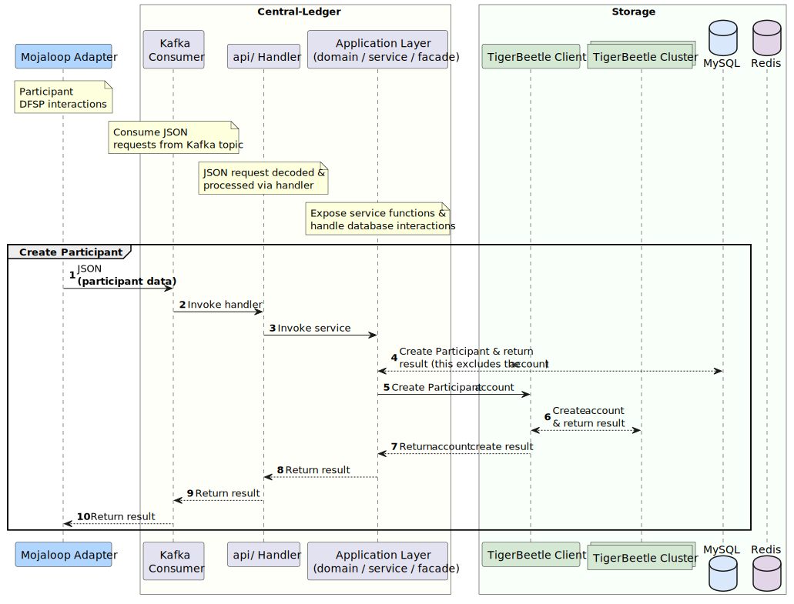
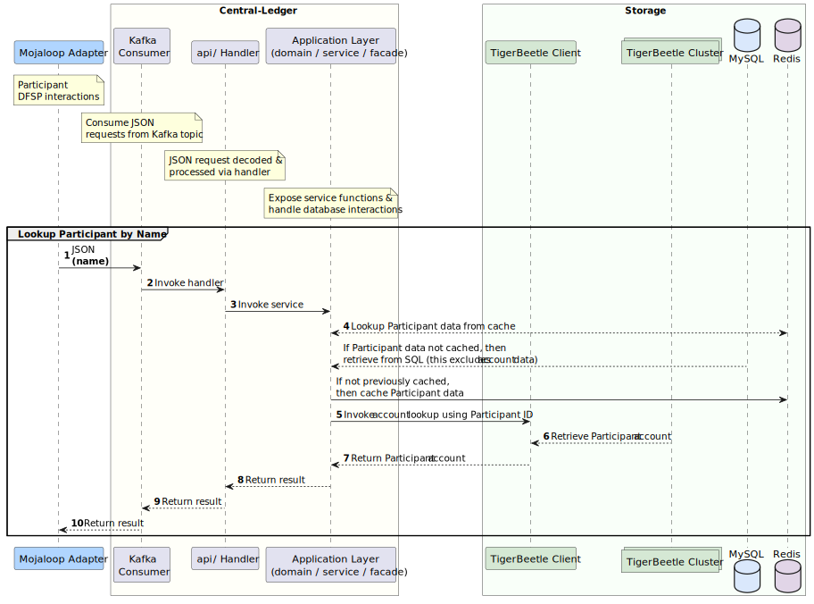
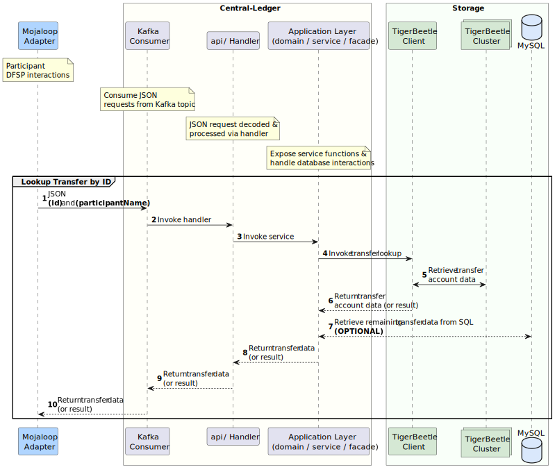

# Solution Design: Mojaloop TigerBeetle Integration

[Glossary](#glossary)
1. [Purpose](#1-purpose)
2. [Introduction](#2-introduction)
3. [Architecture and Design](#3-architecture-and-design)  
3.1. [Architecture and Design Principles](#31-architecture-and-design-principles)  
3.2. [Current Mojaloop Architecture](#32-current-mojaloop-architecture)  
3.3. [Central-Ledger Architecture](#33-central-ledger-architecture)
4. [Requirements](#4-requirements)  
4.1. [Functional Requirements](#41-functional-requirements)  
4.2. [Non-Functional Requirements](#42-non-functional-requirements)
5. [Assumptions, Dependencies & Considerations](#5-dependencies--considerations)
6. [Scope Exclusions](#6-scope-exclusions)
7. [Detailed Design](#7-detailed-design---tigerbeetle-in-central-ledger)  
7.1. [Participants](#71-participants)  
7.2. [Transfers](#72-transfers)
8. [Canonical Model](#8-canonical-model)  
8.1. [TigerBeetle](#81-tigerbeetle)  
8.2. [Central-Ledger](#82-central-ledger)  
8.3. [TigerBeetle and Central-Ledger Mapping](#83-tigerbeetle-and-central-ledger-mapping)  
[References](#references)  

## Glossary
| Definition  | Description                                                                                                                                                                                                                                                               |
|-------------|---------------------------------------------------------------------------------------------------------------------------------------------------------------------------------------------------------------------------------------------------------------------------|
| DFSP        | Digital Financial Service Provider.                                                                                                                                                                                                                                       |
| DMZ         | A demilitarized zone is perimeter network or subnetwork that adds a layer of network security, typically for connections to entities that are external to a network, but also used for internal connections, to enforce restricted network access.                        |
| Endpoint    | An API is a set of protocols and tools to facilitate interaction between two applications. An endpoint is a place on the API where the exchange happens. Endpoints are URIs (Uniform Resource Indices) on an API that an application can access. All APIs have endpoints. |
| HTTPS       | Stands for "HyperText Transport Protocol Secure." HTTPS is the same thing as HTTP, but uses a secure socket layer (SSL) for security purposes.                                                                                                                            |
| Hub         | A Mojaloop platform where one ore more financial services providers integrate multiple payments systems and channels into a payments platform that is managed by one ore more hub operators.                                                                              |
| JSON        | JSON (JavaScript Object Notation) is a lightweight data-interchange format.                                                                                                                                                                                               |
| Participant | A provider who is a member of a payment scheme, and subject to that scheme's rules.                                                                                                                                                                                       |
| PISP        | A payments initiation service provider is an authorized third-party that enables payments initiation directly from the wallet or account of an account holder.                                                                                                            |
| REST        | Representational state transfer (REST) is a software architectural style that was created to guide the design and development of the architecture for the World Wide Web.                                                                                                 |
| TigerBeetle | A financial accounting database designed for mission critical safety and performance to power the future of financial services.                                                                                                                                           |
| TLS/SSL     | Transport Layer Security (TLS) certificates—most commonly known as SSL, or digital certificates—are the foundation of a safe and secure internet. TLS/SSL certificates secure internet connections by encrypting data sent between systems.                               |
| Transfer    | A debit/credit from one account to another account.                                                                                                                                                                                                                       |
| VPN Tunnel  | A VPN tunnel is an encrypted link between your computer or mobile device and an outside network. A VPN tunnel — short for virtual private network tunnel — can provide a way to cloak some of your online activity.                                                       |
| WAF         | A WAF or web application firewall helps protect web applications by filtering and monitoring HTTP traffic between a web application and the Internet (_or internal network_).                                                                                             |
---

## 1. Purpose
This document proposes the solution architecture and design for using a TigerBeetle database as the back-end for the Central Ledger services of a Mojaloop payments system.

Different sections of this document can be used by an audience that is focussed on:
* the business drivers and user stories for the solution;
* the architecture and solution design aspects for integrating TigerBeetle into Mojaloop; and
* the components and endpoints that constitute the proposed solution.

## 2. Introduction
The original design of the Mojaloop payments system uses Redis for caching and SQL databases to record participant, transaction, settlement and operational data. In the original design, the application layer implements the business processing and financial accounting logic, interacting with the database to persist and retrieve the data. 

TigerBeetle is a distributed database built for native financial accounting support. It leverages the original Mojaloop Central-Ledger logic in order to implement the financial accounting logic natively, within the database. In this proposed solution, the Mojaloop application layer optimizes its database interactions and defers the financial accounting logic to TigerBeetle.

## 3. Architecture and Design
### 3.1 Architecture and Design Principles

The underlying design principles include:

- A push payment model with immediate funds transfer and same day settlement 
- Open-loop interoperability between providers
- Adherence to well-defined and adopted international standards
- Adequate system-wide shared fraud and security protection
- Efficient and proportional identity and know-your-customer (KYC) requirements
- Meeting or exceeding the convenience, cost and utility of cash

### 3.2. Current Mojaloop Architecture
The diagram below shows the current architecture of a Mojaloop payments hub and it illustrates interactions between the hub and external entities such as a settlement bank, a global account lookup service and the systems of other financial service providers.

The Mojaloop Hub is the primary container and reference we use to describe the Mojaloop ecosystem which is split into the following domains:
- Mojaloop Open Source Services 
  - Core Mojaloop Open Source Software (OSS) that has been supported by the Bill & Melinda Gates Foundation in partnership with the Open Source Community. 
- Mojaloop Hub 
  - Overall Mojaloop reference (and customizable) implementation for Hub Operators is based on the above OSS solution.

<br><br>


### 3.3. Central-Ledger Architecture
#### 3.3.1. As Is - Central-Ledger
A closer look at the current Central Services architecture, with the Central-Ledger using SQL, PostgreSQL and Redis.<br><br>


#### 3.3.2. To Be - Central-Ledger
This diagram depicts the proposed Central Services architecture with the Central-Ledger running TigerBeetle together with SQL and Redis databases.<br><br>


## 4. Requirements
### 4.1. Functional Requirements
#### 4.1.1. User Stories & Business Processes
In the table below, the Mojaloop hub use-cases and transaction scenarios are mapped to the TigerBeetle functional areas:

| Requirements                                                       | Accounts | Transfers | Queries |
|--------------------------------------------------------------------|----------|-----------|---------|
| Funds transfers                                                    | X        | X         |         |
| Purchase goods                                                     | X        | X         |         |
| Bulk purchases                                                     | X        | X         |         |
| Enquiries (accounts & balances)                                    |          |           | X       |
| Account management (participants & customers)                      | X        |           |         |
| Fraud Checks and blacklists (enforce account statuses)             |          |           | X       |
| Tiered risk management (enforce account statuses & balance limits) |          |           | X       |
 
* TigerBeetle NodeJS integrated into Central-Ledger
  * Make use of existing configuration `default.json` configuration file for client
  * TigerBeetle NodeJS client to be integrated into central-ledger
  * TigerBeetle enablement through on/off switch
  * TigerBeetle and central-ledger facade (Translate from CL Acc+Transfer to TigerBeetle Acc+Transfer)
* jMeter endpoints for:
  * Create a participant
  * Lookup participant
  * Create a Transfer
  * Lookup a Transfer
* Timeout function to be reliant on TigerBeetle instead of timer
* Transfer duplicate check performed as part of TigerBeetle built in functionality
* jMeter testing suite to test the following functionality:
  * Transfer
  * 2-Phase Transfer
  * Account & Participant Creation
  * Account Lookups
  * Transfer Lookups
* This is a change.

#### Impact On User Experience
#### System Behaviour In different scenarios
#### Impact on customer support or operations

### 4.2. Non-functional Requirements
#### Performance In TigerBeetle
Making use of TigerBeetle in Central-Ledger would mean a significant increase in performance and throughput.
TigerBeetle provides more performance than a general-purpose relational database such as MySQL or an in-memory database such as Redis:

* TigerBeetle **uses small, simple fixed-size data structures** (accounts and transfers) and a tightly scoped domain.
* TigerBeetle **performs all balance tracking logic in the database**. This is a paradigm shift where we move the code once to the data, not the data back and forth to the code in the critical path. This eliminates the need for complex caching logic outside the database. The “Accounting” business logic is built in to TigerBeetle so that you can **keep your application layer simple, and completely stateless**.
* TigerBeetle **supports batching by design**. You can batch all the transfer prepares or commits that you receive in a fixed 10ms window (or in a dynamic 1ms through 10ms window according to load) and then send them all in a single network request to the database. This enables low-overhead networking, large sequential disk write patterns and amortized fsync and consensus across hundreds and thousands of transfers.
  * Everything is a batch. It's your choice whether a batch contains 100 transfers or 10,000 transfers but our measurements show that **latency is _less_ where batch sizes are larger, thanks to Little's Law** (e.g. 50ms for a batch of a hundred transfers vs 20ms for a batch of ten thousand transfers). 
  * TigerBeetle is able to amortize the cost of I/O to achieve lower latency, even for fairly large batch sizes, by eliminating the cost of queueing delay incurred by small batches.
* If your system is not under load, TigerBeetle also **optimizes the latency of small batches**. After copying from the kernel's TCP receive buffer (TigerBeetle does not do user-space TCP), TigerBeetle **does zero-copy Direct I/O** from network protocol to disk, and then to state machine and back, to reduce memory pressure and L1-L3 cache pollution.
* TigerBeetle **uses io_uring for zero-syscall networking and storage I/O**. The cost of a syscall in terms of context switches adds up quickly for a few thousand transfers.
* TigerBeetle **does zero-deserialization** by using fixed-size data structures, that are optimized for cache line alignment to **minimize L1-L3 cache misses**.
* TigerBeetle **takes advantage of Heidi Howard's Flexible Quorums** to reduce the cost of **synchronous replication to one (or two) remote replicas at most** (in addition to the leader) with **asynchronous replication** between the remaining followers. This improves write availability, without sacrificing strict serializability or durability. This also reduces server deployment cost by as much as 20% because a 4-node cluster with Flexible Quorums can now provide the same `f=2` guarantee for the replication quorum as a 5-node cluster.
> ["The major availability breakdowns and performance anomalies we see in cloud environments tend to be caused by subtle underlying faults, i.e. gray failure (slowly failing hardware) rather than fail-stop failure."](https://www.microsoft.com/en-us/research/wp-content/uploads/2017/06/paper-1.pdf)
* TigerBeetle **routes around transient gray failure latency spikes**. 
  * For example, if a disk write that typically takes 4ms starts taking 4 seconds because the disk is slowly failing, TigerBeetle will use cluster redundancy to mask the gray failure automatically without the user seeing any 4 second latency spike. This is a relatively new performance technique in the literature known as "tail tolerance".

#### Safety in TigerBeetle
TigerBeetle is designed to a higher safety standard than a general-purpose relational database such as MySQL or an in-memory database such as Redis:
Strict consistency, CRCs and crash safety are not enough.

* TigerBeetle **detects and repairs disk corruption** ([3.45% per 32 months, per disk](https://research.cs.wisc.edu/wind/Publications/latent-sigmetrics07.pdf)), **detects and repairs misdirected writes** where the disk firmware writes to the wrong sector ([0.042% per 17 months, per disk](https://research.cs.wisc.edu/wind/Publications/latent-sigmetrics07.pdf)), and **prevents data tampering** with hash-chained cryptographic checksums.
* TigerBeetle **uses Direct I/O by design** to side step cache coherency bugs in the kernel page cache after an EIO fsync error.
* TigerBeetle **exceeds the fsync durability of a single disk** and the hardware of a single server because disk firmware can contain bugs and because single server systems fail.
* TigerBeetle **provides strict serializability**, the gold standard of consistency, as a replicated state machine, and as a cluster of TigerBeetle servers (called replicas), for optimal high availability and distributed fault-tolerance.
* TigerBeetle **performs synchronous replication** to a quorum of TigerBeetle servers using the pioneering [Viewstamped Replication](http://pmg.csail.mit.edu/papers/vr-revisited.pdf) and consensus protocol, for low-latency automated leader election and to eliminate the risk of split brain associated with manual failover.
* TigerBeetle is “fault-aware” and **recovers from local storage failures in the context of the global consensus protocol**, providing [more safety than replicated state machines such as ZooKeeper and LogCabin](https://www.youtube.com/watch?v=fDY6Wi0GcPs). For example, TigerBeetle can disentangle corruption in the middle of the committed journal (caused by bitrot) from torn writes at the end of the journal (caused by power failure) to uphold durability guarantees given for committed data and maximize availability.
* TigerBeetle does not depend on synchronized system clocks, does not use leader leases, and **performs leader-based timestamping** so that your application can deal only with safe relative quantities of time with respect to transfer timeouts. To ensure that the leader's clock is within safe bounds of "true time", TigerBeetle combines all the clocks in the cluster to create a fault-tolerant clock that we call ["cluster time"](https://www.tigerbeetle.com/post/three-clocks-are-better-than-one).

##### Secure Transport
* HTTPS on central-ledger endpoints may be configured in NodeJS or WAF/Load-Balancer
* Communication between Central-Ledger and TigerBeetle will make use of a secure VPN tunnel
* Non PCI-DSS sensitive information stored in TigerBeetle

##### Secure Storage at Rest
* TigerBeetle stores all data at rest encrypted.
* MySQL database for Central-Ledger to be configured for:
  * TLS/SSL communication between Central-Ledger and MySQL.
  * MysQL Keyring plugin may be used to encrypt data at rest (https://aimlessengineer.com/2021/04/26/data-at-rest-encryption-in-mysql/).
* Security of sensitive data in the database.

##### Other
* Authentication of the CL API
* Update Central-Ledger documentation during the course of the project

#### Testing
Existing unit tests for Central-Ledger will be updated to test TigerBeetle and Central-Ledger integration. 
jUnit will be used to test performance and safety.

Testing coverage includes:
* Unit testing for TigerBeetle NodeJS client
* Integration testing for TigerBeetle NodeJS client
* Integration testing for Central-Ledger and TigerBeetle
  * TigerBeetle enabled
  * TigerBeetle disabled (_traditional_)
* Performance, throughput and safety (_via jMeter_)

## 5. Dependencies & Considerations

### 5.2 Hardware Dependencies
The following hardware dependencies are known.
#### TigerBeetle
- 7x TigerBeetle nodes, each being
  - 2x vCPUs, 4GB of RAM, and >5gb storage (depending on use case)

#### Mojaloop Hub
- Control Plane (i.e. Master Node)
  - https://kubernetes.io/docs/setup/cluster-large/#size-of-master-and-master-components
- 3x Master Nodes for future node scaling and HA (High Availability)
- ETCd Plane:
  - https://etcd.io/docs/v3.3.12/op-guide/hardware
  - 3x ETCd nodes for HA (High Availability)
- Compute Plane (i.e. Worker Node):
  - TBC once load testing has been concluded. However the current general recommended size:
- 3x Worker nodes, each being:
  - 4x vCPUs, 16GB of RAM, and 40gb storage
  
> Note that this would also depend on your underlying infrastructure, and it does NOT include requirements for persistent volumes/storage.


### 5.3 Software Dependencies
The following software dependencies are known.
#### TigerBeetle
TigerBeetle release in a single executable file which is supported in the following operating systems:
* Linux (`x64`)
* MacOS (`x64/arm`)
* Windows (`x64`)

#### Mojaloop

The Mojaloop Hub is the primary container and reference we use to describe the core Mojaloop components.
The following component diagram shows the break-down of the Mojaloop services and its micro-service architecture:


> Note: Colour-grading indicates the relationship between data-store, and message-streaming / adapter-interconnects. E.g. Central-Services utilise `MySQL` as a Data-store, and leverage on `Kafka` for Messaging

These consist of:
- The Mojaloop API Adapters (ML-API-Adapter) provide the standard set of interfaces a DFSP can implement to connect to the system for Transfers. A DFSP that wants to connect up can adapt our example code or implement the standard interfaces into their own software. The goal is for it to be as straightforward as possible for a DFSP to connect to the interoperable network.
- The `Central Services` (Central-Ledger, CentralSettlement etc.) provide the set of components required to move money from one DFSP to another through the Mojaloop API Adapters. This is similar to how money moves through a central bank or clearing house in developed countries. The Central Services contains the core Central-Ledger logic to move money but also will be extended to provide fraud management and enforce scheme rules.
- The Account Lookup Service (ALS) provides a mechanism to resolve FSP routing information through the Participant API or orchestrate a Party request based on an internal Participant look-up. The internal Participant look-up is handled by a number of standard Oracle adapter or services. Example Oracle adapter/service would be to look-up Participant information from Pathfinder or a Merchant Registry. These Oracle adapters or services can easily be added depending on the schema requirements.
- The Quoting Service (QA) provides Quoting is the process that determines any fees and any commission required to perform a financial transaction between two FSPs. It is always initiated by the Payer FSP to the Payee FSP, which means that the quote flows in the same way as a financial transaction.
- The Simulator (SIM) mocks several DFSP functions as follows:
  - Oracle end-points for Oracle Participant CRUD operations using in-memory cache;
  - Participant end-points for Oracles with support for parameterized partyIdTypes;
  - Parties end-points for Payer and Payee FSPs with associated callback responses;
  - Transfer end-points for Payer and Payee FSPs with associated callback responses; and
  - Query APIs to verify transactions (requests, responses, callbacks, etc) to support QA testing and verification.
  - On either side of the Mojaloop Hub there is sample open source code to show how a DFSP can send and receive payments and the client that an existing DFSP could host to connect to the network.


## 6. Scope Exclusions
The following functionality will be excluded from Phase-1:
* Integration into CentralSettlement
* Updated NodeJS that merges TigerBeetle `Transfer`/`Commit`

## 7. Detailed Design - TigerBeetle in Central-Ledger 
The detail design process primarily involves the conversion of the loft from the preliminary design into something that can be built and ultimately flown.

### 7.1. Participants
Sequence related to participants with relation to Central-Ledger and TigerBeetle.

#### 7.1.1 Create Participant


1. Participant JSON Payload for HTTP `POST`.
```json
{
  "id": "123",
  "name": "fspJM61d20f876f3c47828fc9f9a70",
  "currency": "USD",
  "newlyCreated": false
}
```
2. Handler invoked from `/jmeter/participants/create` endpoint.
3. Service layer invoked
4. Domain / Service to Facade layer
5. The Database transaction is initiated to store the participant and account data in the following tables;
   1. `participant`
   2. `participantCurrency`
   3. `participantPosition`
6. The TigerBeetle client is invoked to create the participant account.
7. The account create request is received.
8. The account is created and distributed to all TigerBeetle nodes in the cluster via VSR.
9. Errors for the account creation (which is always batched) is returned. In this case there were no errors.
10. The database transaction is regarded as successful, and the database transaction is committed.
11. Result returned.
12. Result returned.
13. Result returned.
14. `JSON` HTTP `200` response returned to indicate success.

#### 7.1.2 Lookup Participant by Name


1. DFSP/Mojaloop Adapter invokes HTTP request
2. Handler invoked from `/jmeter/participants/{name}` `GET` endpoint.
3. Service layer invoked.
4. Domain / Service to Facade layer.
5. Participant data is retrieved from Redis via participant `name`.
   1. If the data is not available in the cache, a lookup in the Central-Ledger database is performed, followed by caching the participant data.
6. The TigerBeetle client is invoked in order to obtain the `account` information.
7. TigerBeetle client fetches the necessary account information from one of the TigerBeetle nodes.
8. Account data is returned from the TigerBeetle client.
9. **OPTIONAL** Additional account meta-data is fetched based on `accountId`.
10. Result returned.
11. Result returned.
12. Result returned.
13. HTTP `JSON` response with account and balance related information.

### 7.2. Transfers
Sequence related to a transfer with relation to Central-Ledger and TigerBeetle.

#### 7.2.1 Create Transfer (2-Phase)


1. DFSP submits a Transfer JSON Payload (Prepare followed by Fulfil)
```json
{
  "payerFsp": "fspJM962250a50c654d1a9f3d32b9a",
  "amount": {
      "amount": 95,
      "currency": "USD"
  },
  "condition": "GRzLaTP7DJ9t4P-a_BA0WA9wzzlsugf00-Tn6kESAfM",
  "payeeFsp": "fspJM9bd046148c074bdca6323ab12",
  "ilpPacket": "AYIBgQAAAAAAAASwNGxldmVsb25lLmRmc3AxLm1lci45T2RTOF81MDdqUUZERmZlakgyOVc4bXFmNEpLMHlGTFGCAUBQU0svMS4wCk5vbmNlOiB1SXlweUYzY3pYSXBFdzVVc05TYWh3CkVuY3J5cHRpb246IG5vbmUKUGF5bWVudC1JZDogMTMyMzZhM2ItOGZhOC00MTYzLTg0NDctNGMzZWQzZGE5OGE3CgpDb250ZW50LUxlbmd0aDogMTM1CkNvbnRlbnQtVHlwZTogYXBwbGljYXRpb24vanNvbgpTZW5kZXItSWRlbnRpZmllcjogOTI4MDYzOTEKCiJ7XCJmZWVcIjowLFwidHJhbnNmZXJDb2RlXCI6XCJpbnZvaWNlXCIsXCJkZWJpdE5hbWVcIjpcImFsaWNlIGNvb3BlclwiLFwiY3JlZGl0TmFtZVwiOlwibWVyIGNoYW50XCIsXCJkZWJpdElkZW50aWZpZXJcIjpcIjkyODA2MzkxXCJ9IgA",
  "expiration": null,
  "transferId": "f75f50d8-f584-4451-889b-fee8bc350db0",
  "fulfil": false
}
```
2. Handler invoked from `/jmeter/transfers/prepare` `POST` endpoint.
3. Service layer invoked
4. Domain / Service to Facade layer.
5. The following validations are performed prior to the transfer:
   1. `validateFspiopSourceMatchesPayer` -> Asserts headers['fspiop-source'] matches payload.payerFsp
   2. `validateParticipantByName` -> Asserts payer participant exists by doing a lookup by name (discards result of lookup work)
   3. `validatePositionAccountByNameAndCurrency` -> Asserts account exists for name-currency tuple (discards result of lookup work)
   4. `validateParticipantByName` -> Asserts payee participant exists by doing a lookup by name (discards result of lookup work)
   5. `validatePositionAccountByNameAndCurrency` -> Asserts account exists for name-currency tuple (discards result of lookup work)
   6. `validateAmount` -> Validates allowed scale of decimal places and allowed precision
   7. `validateConditionAndExpiration` -> Validates condition and expiration
   8. `validateDifferentDfsp` -> Asserts lowercase string comparison of `payload.payerFsp` and `payload.payeeFsp` is different
6. Lookup Payer and Payee Participants via name, account type (_POSITION_) and currency
   1. If participant data is not available in Redis, a database lookup is performed, followed by the participant data being cached in Redis
7. TigerBeetle pending `pending = true` //Transfer// created via TigerBeetle NodeJS client.
```zig
Transfer{
    .id = 1002,
    .debit_account_id = 1,
    .credit_account_id = 2,
    .user_data = 0,
    .reserved = [_]u8{0} ** 32,
    .timeout = std.time.ns_per_hour,
    .code = 0,
    .flags = .{
        .pending = true, // Set this transfer to be two-phase.
        .linked = true, // Link this transfer with the next transfer 1003.
    },
    .amount = 1,
}
```
8. Transfer distributed via the TigerBeetle state machine.
9. The transfer is distributed to all 7 TigerBeetle nodes in the cluster.
10. The TigerBeetle API responds with errors during the transfer, which is empty (_no errors_).
11. Return result to service layer.
12. Return result to the handler layer.
13. Prepare the result in JSON format.
14. Result is returned to the DFSP via the REST API
15. Insert duplicate check for //Transfer// into the following database table:
    1. `transferDuplicateCheck`
16. Insert //Transfer// data into the following database tables:
    1. `transfer`
    2. `transferParticipant` (Payer)
    3. `transferParticipant` (Payee)
    4. `ilpPacket`
    5. `transferStateChange`
    6. `participantPosition`
    7. `participantPositionChange`
17. The //Transfer// database transaction is committed.
18. DFSP submits a //Transfer// JSON Fulfi Payload
```json
{
  "transferId": "f75f50d8-f584-4451-889b-fee8bc350db0",
  "fulfil": true
}
```
19. Handler invoked from `/jmeter/transfers/fulfil` `POST` endpoint.
20. Service layer invoked
21. Domain / Service to Facade layer. 
22. New database transaction is initiated for the //Transfer// fulfil.
23. The current open `settlementWindowId` is obtained for the current **OPEN** settlement window.
    1. The settlement window is based on **OPEN** state and currency.
24. The TigerBeetle client is invoked with a //Transfer// `post_pending_transfer = true` property
```zig
Transfer{
    .id = 1001,
    .debit_account_id = 1,
    .credit_account_id = 2,
    .user_data = 0,
    .reserved = [_]u8{0} ** 32,
    .timeout = 0,
    .code = 0,
    .flags = .{ .post_pending_transfer = true }, // Post the pending two-phase transfer.
    .amount = 0, // Inherit the amount from the pending transfer.
},
```
25. Transfer fulfillment distributed via the TigerBeetle state machine.
26. The transfer fulfilment is distributed to all 7 TigerBeetle nodes in the cluster.
27. The TigerBeetle client API responds with errors during the transfer, which is empty (_no errors_).
28. Insert //Transfer// fulfilment data into the following database tables:
    1. `transferFulfilment`
    2. `transferStateChange`
29. Database transaction is commmitted.
30. Return result to service layer.
31. Return result to the handler layer.
32. Prepare the result in JSON format.
33. Result is returned to the DFSP via the REST API

#### 7.2.2 Lookup Transfer by ID


1. DFSP/Mojaloop Adapter invokes HTTP request
2. Handler invoked from `/jmeter/participants/{name}/transfers/{id}` `GET` endpoint.
3. Service layer invoked.
4. Domain / Service to Facade layer.
5. The TigerBeetle client is invoked in order to obtain the `account` information.
6. TigerBeetle client fetches the necessary account information from one of the TigerBeetle nodes.
7. Transfer data is returned from the TigerBeetle client.
8. **OPTIONAL** Additional transfer meta-data is fetched based on `transactionId`.
9. Result returned.
10. Result returned.
11. Result returned.
12. HTTP `JSON` response with transfer related information.

## 8. Canonical Model
The following Central-Ledger and TigerBeetle Canonical Data Model presents data entities and relationships in the simplest possible form.

### 8.1 TigerBeetle
TigerBeetle supports only `Account` and `Transfer` data types.

#### 8.1.1 Account
Mutable data set for account related data.

| Field           | Type             | Description                                                                                                                      |
|-----------------|------------------|----------------------------------------------------------------------------------------------------------------------------------|
| id              | `u128`           | Global unique id for an account.                                                                                                 |
| user_data       | `u128`           | Implementation specific data on account. Opaque third-party identifier to link this account (many-to-one) to an external entity. |
| reserved        | `[48]u8 - array` | Accounting policy primitives. Not available.                                                                                     |
| ledger          | `u16`            | The ledger the account belongs to (position, settlement, fees etc).                                                              |
| code            | `u16`            | The currency code/type for the account                                                                                           |
| flags           | `AccountFlags`   | See account flags.                                                                                                               |
| debits_pending  | `u64`            | Balance for reserved debits.                                                                                                     |
| debits_posted   | `u64`            | Balance for accepted debits.                                                                                                     |
| credits_pending | `u64`            | Balance for reserved credits.                                                                                                    |
| credits_posted  | `u64`            | Balance for accepted credits.                                                                                                    |
| timestamp       | `u64`            | The current state machine timestamp of the account for state tracking.                                                           |

#### 8.1.2 AccountFlags - `[packed struct]`

| Field                            | Type              | Description                                  |
|----------------------------------|-------------------|----------------------------------------------|
| linked                           | `bool`            | Is the account linked to another account.    |
| debits_must_not_exceed_credits   | `bool`            | Total debit transfer may not exceed credits. |
| credits_must_not_exceed_debits   | `bool`            | Total credit transfer may not exceed debits. |
| padding                          | `u29`             | Data to be used for padding.                 |

#### 8.1.3 Transfer
Transfers for TigerBeetle are immutable.

| Field             | Type              | Description                                                                                                                       |
|-------------------|-------------------|-----------------------------------------------------------------------------------------------------------------------------------|
| id                | `u128`            | Global unique id for an account.                                                                                                  |
| debit_account_id  | `u128`            | The unit transfer from (Payer) account id.                                                                                        |
| credit_account_id | `u128`            | The unit transfer to (Payee) account id                                                                                           |
| user_data         | `u128`            | Implementation specific data on transfer. Opaque third-party identifier to link this transfer (many-to-one) to an external entity |
| reserved          | `[32]u8 - array`  | Accounting policy primitives. Example; ILP packet.                                                                                |
| timeout           | `u64`             | Used for a 2-phase transfer. The maximum wait timeout in milliseconds for a commit.                                               |
| code              | `u32`             | A chart of accounts code describing the reason for the transfer (e.g. deposit, settlement)                                        |
| flags             | `TransferFlags`   | See transfer flags.                                                                                                               |
| amount            | `u64`             | Transfer amount in units.                                                                                                         |
| timestamp         | `u64`             | The current state machine timestamp of the transfer for state tracking.                                                           |

#### 8.1.4 TransferFlags - `[packed struct]`
Transfer flags are properties associated with a Transfer to enable additional Transfer functionality, such as:
* 2-Phase transfers
* Linked Transfer
* Reverting a previously created transfer
* Reverting a previously committed transfer

| Field       | Type              | Description                                    |
|-------------|-------------------|------------------------------------------------|
| linked      | `bool`            | Is the account linked to another account.      |
| pending     | `bool`            | Is the transfer a 2-phase commit transfer.     |
| condition   | `bool`            | Does the transfer support transfer conditions. |
| padding     | `u29`             | Data to be used for padding.                   |

### 8.2 Central-Ledger
Central-Ledger hosts a wide range of tables in which to store Participant, Account and Transfer related data.

#### 8.2.1 Data Relationships
The following diagrams are used to illustration the relationships between data in Central-Ledger.

##### Central-Ledger Schema with Relationships


##### Participants and Accounts


##### Transfer


#### 8.2.2 Participant (`participant`)
| Field         | Type           | Description                                        |
|---------------|----------------|----------------------------------------------------|
| participantId | `int unsigned` | Unique participant identifier.                     |
| name          | `varchar(256)` | Unique participant name.                           |
| description   | `varchar(256)` | Brief description for a participant.               |
| isActive      | `tinyint`      | Is the participant account active.                 |
| createdDate   | `datetime`     | Timestamp of when the participant was created.     |
| createdBy     | `datetime`     | The DFSP responsible for creating the participant. |

#### 8.2.3 Participant Currency (`participantCurrency`)
| Field                 | Type           | Description                                                |
|-----------------------|----------------|------------------------------------------------------------|
| participantCurrencyId | `int unsigned` | Unique participantCurrency identifier.                     |
| participantId         | `int unsigned` | Foreign key for participant table.                         |
| currencyId            | `int unsigned` | Foreign key for currency table.                            |
| ledgerAccountTypeId   | `int unsigned` | Foreign key for ledgerAccountType table.                   |
| isActive              | `tinyint`      | Is the currency active.                                    |
| createdDate           | `datetime`     | Timestamp of when the participantCurrency was created.     |
| createdBy             | `datetime`     | The DFSP responsible for creating the participantCurrency. |

#### 8.2.4 Participant Contact (`participantContact`)
| Field                 | Type           | Description                                                  |
|-----------------------|----------------|--------------------------------------------------------------|
| participantContactId  | `int unsigned` | Unique participantContact identifier.                        |
| participantId         | `int unsigned` | Foreign key for participant table.                           |
| contactTypeId         | `int unsigned` | Foreign key for contactType table.                           |
| value                 | `varchar(256)` | The details for the contact.                                 |
| priorityPreference    | `int(9)`       | The priority for the contact.                                |
| isActive              | `tinyint`      | Whether the contact is active.                               |
| createdDate           | `datetime`     | Timestamp of when the participantContact was created.        |
| createdBy             | `datetime`     | The DFSP responsible for creating the participantContact.    |


#### 8.2.5 Transfer (`transfer`)
| Field          | Type            | Description                                                                    |
|----------------|-----------------|--------------------------------------------------------------------------------|
| transferId     | `varchar(36)`   | Unique transfer identifier.                                                    |
| amount         | `decimal(18,4)` | The amount of the transfer.                                                    |
| currencyId     | `varchar(3)`    | Foreign key to the transfer currency.                                          |
| ilpCondition   | `varchar(256)`  | The condition from the ILP packet.                                             |
| expirationDate | `datetime`      | The timestamp for when the 2-phase transfer expires in the event of no commit. |
| createdDate    | `datetime`      | The timestamp for when the transfer was created.                               |

#### 8.2.6 Transfer Participant (`transferParticipant`)
| Field                         | Type              | Description                                                 |
|-------------------------------|-------------------|-------------------------------------------------------------|
| transferParticipantId         | `bigint unsigned` | Unique transferParticipant identifier.                      |
| transferId                    | `varchar(36)`     | Foreign key for the transfer.                               |
| participantCurrencyId         | `int unsigned`    | Foreign key for the participantCurrencyId.                  |
| transferParticipantRoleTypeId | `int unsigned`    | Foreign key for the transferParticipantRoleTypeId.          |
| ledgerEntryTypeId             | `int unsigned`    | Foreign key for the ledgerEntryTypeId.                      |
| amount                        | `decimal(18,4)`   | The amount of the transfer.                                 |
| createdDate                   | `datetime`        | The timestamp for when the transferParticipant was created. |

#### 8.2.7 ILP Packet (`ilpPacket`)
| Field        | Type          | Description                                       |
|--------------|---------------|---------------------------------------------------|
| transferId   | `varchar(36)` | Foreign key for the transfer.                     |
| value        | `text`        | Complete ilpPacket.                               |
| createdDate  | `datetime`    | The timestamp for when the ilpPacket was created. |

#### 8.2.8 Transfer State Change (`transferStateChange`)
| Field                 | Type              | Description                                                 |
|-----------------------|-------------------|-------------------------------------------------------------|
| transferStateChangeId | `bigint`          | Unique transferStateChange identifier.                      |
| transferId            | `varchar(36)`     | Foreign key for the transfer.                               |
| transferStateId       | `varchar(50)`     | Foreign key for the transferStateId.                        |
| reason                | `varchar(512)`    | Reason for state change.                                    |
| createdDate           | `datetime`        | The timestamp for when the transferStateChange was created. |

#### 8.2.9 Participant Position (`participantPosition`)
| Field                 | Type              | Description                                                      |
|-----------------------|-------------------|------------------------------------------------------------------|
| participantPositionId | `bigint unsigned` | Unique participantPosition identifier.                           |
| participantCurrencyId | `int unsigned`    | Foreign key for the participantCurrency.                         |
| value                 | `decimal(18,4)`   | Current participant position.                                    |
| reservedValue         | `decimal(18,4)`   | Current participant reserved position.                           |
| changedDate           | `datetime`        | The timestamp for when the participantPosition was last updated. |

#### 8.2.10 Participant Position Change (`participantPositionChange`)
| Field                       | Type                 | Description                                                    |
|-----------------------------|----------------------|----------------------------------------------------------------|
| participantPositionChangeId | `bigint unsigned`    | Unique participantPositionChangeId identifier.                 |
| participantPositionId       | `bigint unsigned`    | Foreign key for the participantPosition.                       |
| transferStateChangeId       | `bigint unsigned`    | Foreign key for the transferStateChange.                       |
| value                       | `decimal(18,4)`      | The participant position at time of state change.              |
| reservedValue               | `decimal(18,4)`      | The participant reserved position at time of state change.     |
| createdDate                 | `datetime`           | The timestamp for when the participantPositionChange occurred. |

#### 8.2.11 Participant Limit (`participantLimit`)
| Field                                 | Type              | Description                                              |
|---------------------------------------|-------------------|----------------------------------------------------------|
| participantLimitId                    | `bigint unsigned` | Unique participantLimit identifier.                      |
| participantCurrencyId                 | `bigint unsigned` | Foreign key for the participantCurrency.                 |
| participantLimitTypeId                | `bigint unsigned` | Foreign key for the participantLimitType.                |
| startAfterParticipantPositionChangeId | `bigint unsigned` | Foreign key for the participantPositionChange.           |
| value                                 | `decimal(18,4)`   | Unique participant identifier.                           |
| thresholdAlarmPercentage              | `decimal(5,2)`    | The allowed threshold of the alarm.                      |
| isActive                              | `tinyint`         | Whether the participant limit is active.                 |
| createdDate                           | `datetime`        | Timestamp of when the participantLimit was created.      |
| createdBy                             | `datetime`        | The DFSP responsible for creating the participantLimit.  |

#### 8.2.12 Transfer Duplicate Check (`transferDuplicateCheck`)
| Field        | Type           | Description                                                  |
|--------------|----------------|--------------------------------------------------------------|
| transferId   | `varchar(32)`  | Unique transfer identifier (UUID).                           |
| hash         | `varchar(256)` | Unique hash for the transfer JSON request.                   |
| createdDate  | `datetime`     | The timestamp for when the transferDuplicateCheck occurred.  |

### 8.3 TigerBeetle and Central-Ledger Mapping
The following tables illustrate the data mappings between Central-Ledger and TigerBeetle.

#### 8.3.1 Account
The mapping between TigerBeetle accounts and Central-Ledger participant and surrounding mappings (participant, participantCurrency, participantPosition etc.).

| TigerBeetle Field   | Central-Ledger Mapping                    | Description                                                                                                             |
|---------------------|-------------------------------------------|-------------------------------------------------------------------------------------------------------------------------|
| `id`                | Not applicable.                           | Global unique id for an account.                                                                                        |
| `user_data`         | `participant.participantId`               | Each participant will have multiple accounts per `participantId` depending on `ledger` and `code`. One to many mapping. |
| `reserved`          | Not applicable.                           | Reserved for future use.                                                                                                |
| `ledger`            | `currency.currencyId`                     | Each Central-Ledger 'currency id' maps to a TigerBeetle ledger currency (USD, ZAR, EUR etc).                            |
| `code`              | `ledgerAccountType.ledgerAccountTypeId`   | Each Central-Ledger ' account type' maps to a TigerBeetle code.                                                         |
| `flags`             | `participantLimit`                        | Flags are TigerBeetle specific. Typical flags would be credit/debit to not exceed credit/debit.                         |
| `debits_pending`    | `participantPosition`                     | Debit balance for an account awaiting rollback or fulfilment.                                                           |
| `debits_posted`     | `participantPosition`                     | Debit balance for fulfilled transfers.                                                                                  |
| `credits_pending`   | `participantPosition`                     | Credit balance for an account awaiting rollback or fulfilment.                                                          |
| `credits_posted`    | `participantPosition`                     | Credit balance for fulfilled transfers.                                                                                 |
| `timestamp`         | Not applicable.                           | TigerBeetle specific functionality.                                                                                     |

#### 8.3.2 Transfer
The mapping between TigerBeetle transfers and Central-Ledger transfer and surrounding mappings (transfer, transferParticipant, expiringTransfer etc.).

TigerBeetle financial domain makes use of double-entry -accounts.

| TigerBeetle Field   | Central-Ledger Mapping                       | Description                                                                                  |
|---------------------|----------------------------------------------|----------------------------------------------------------------------------------------------|
| `id`                | Not applicable.                              | Global unique id for a transfer.                                                             |
| `debit_account_id`  | `transferParticipant.transferParticipantId`  | The TigerBeetle `account.id` referenced as the foreign key for Payer.                        |
| `credit_account_id` | `transferParticipant. transferParticipantId` | The TigerBeetle `account.id` referenced as the foreign key for Payee.                        |
| `user_data`         | `transfer.transferId`                        | The Central-Ledger `transferId` referenced to link transfers in TigerBeetle.                 |
| `reserved`          | Not applicable.                              | Reserved for future use.                                                                     |
| `pending_id`        | Not applicable.                              | The TigerBeetle id for the Transfer created as a prepare transfer.                           |
| `ledger`            | `currency.currencyId`                        | Each Central-Ledger 'currency id' maps to a TigerBeetle ledger currency (USD, ZAR, EUR etc). |
| `timeout`           | `expiringTransfer.expirationDate`            | The TigerBeetle transfer timeout matches the Central-Ledger `expirationDate`.                |
| `code`              | `ledgerAccountType.ledgerAccountTypeId`      | The TigerBeetle account type code, such as 1=position, 2=settlement, 3=fees etc.             |
| `flags`             | Not applicable.                              | TigerBeetle internal flags for linking transfers, posting and reversing 2-phase transfers.   |
| `amount`            | `transfer.amount`                            | Values are expressed in the minor denomination (e.g. cents) for TigerBeetle.                 |
| `timestamp`         | Not applicable.                              | The current state machine timestamp of the transfer for state tracking.                      |


## References
| Title                            | Link                                                                        |
|----------------------------------|-----------------------------------------------------------------------------|
| TigetBeetle                      | https://www.tigerbeetle.com/                                                |
| TigetBeetle on GitHub            | https://github.com/coilhq/tigerbeetle                                       |
| Central-Ledger on GitHub         | https://github.com/mojaloop/central-ledger                                  |
| Mojaloop Technical Overview      | https://docs.mojaloop.io/legacy/mojaloop-technical-overview/                |
| Central-Ledger Process Design    | https://docs.mojaloop.io/legacy/mojaloop-technical-overview/central-ledger/ |
| Central-Ledger API Specification | https://docs.mojaloop.io/legacy/api/#central-ledger-api                     |


## Notes
Please keep the following notes in mind.

- Linking the accounts in TigerBeetle with Mojaloop:
  - Create accounts with the same `user_data` per Participant, then mark them as linked?
  - For each account type, we use `code`
  - For each currency, we use `ledger`
- Indicating linked flags for linked events in TigerBeetle:
  - When the .linked flag is specified, it links an event with the next event in the batch, to create a chain of events, of arbitrary length, which all succeed or fail together.
  - The tail of a chain is denoted by the first event without this flag.
  - The last event in a batch may therefore never have the `.linked` flag set as this would leave a chain open-ended.
  - Multiple chains or individual events may coexist within a batch to succeed or fail independently.
  - Events within a chain are executed within order, or are rolled back on error, so that the effect of each event in the chain is visible to the next, and so that the chain is either visible or invisible as a unit to subsequent events after the chain.
  - The event that was the first to break the chain will have a unique error result. Other events in the chain will have their error result set to `.linked_event_failed`.